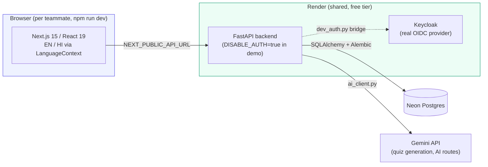

# PRISM — Personalized Readiness Intelligence & Skill Mapping

<div align="center">

**A bilingual, explainable competency-gap engine for government skill development — built for Smart India Hackathon 2026 (PS: 26101).**

[](https://github.com/Deltasthicc/PRISM/actions/workflows/ci.yml)
[](https://github.com/Deltasthicc/PRISM/actions/workflows/keepalive.yml)


-4169E1?logo=postgresql&logoColor=white)


[Live demo](#-live-demo) · [What it does](#-what-prism-actually-does) · [Architecture](#-architecture) · [What's real vs. mockup](#-whats-real-and-whats-a-mockup) · [Local setup](#-running-it-locally) · [API](#-api-reference) · [Known limitations](#-known-limitations)

</div>

---

## 📖 What PRISM actually does

Government officers (MoSPI-style: statistical officers, analysts, policy staff) need a way to know exactly *which* skills they're missing, *why*, and *what to do about it* — without a vague "take this course" recommendation. PRISM is a **deterministic, explainable competency-gap engine**: it blends a learner's self-assessment with demonstrated performance (quiz results, exercises) at a fixed **65% demonstrated / 35% self-assessed** weighting, maps the result against a curated, government-source-cited competency catalog, and generates a personalized learning pathway with a plain-language rationale for every gap it identifies.

It ships as a small "quest" game shell (XP, levels, a boss-fight metaphor for hard topics, a leaderboard) wrapped around that real assessment engine, because a hackathon demo needs to be inviting — but the numbers underneath are real, not decorative.

**Four curricula, ~57 competencies**, each traceable to an actual government or standards document (see [`backend/services/competency_docs.py`](backend/services/competency_docs.py) and [`curricula.py`](backend/services/curricula.py)):
- DSA Fundamentals
- Official Statistics & Data Governance
- Public Policy
- Digital Literacy

The whole UI and the deterministic gap-analysis prose is available in **English and Hindi**, switchable live from the navbar — no page reload required.

## 🖥️ Live demo

The backend is deployed on Render, backed by a Neon Postgres database:

- API: `https://prism-backend-2voe.onrender.com`
- Auth provider (Keycloak, largely vestigial in demo mode — see [Auth model](#-auth-model-read-this-before-you-judge-the-security)): `https://prism-keycloak.onrender.com`

There is no hosted frontend — everyone on the team runs `npm run dev` locally against the shared backend. A [`keepalive` workflow](.github/workflows/keepalive.yml) pings both services every 10 minutes so Render's free tier doesn't cold-start them mid-demo (a cold Keycloak boot is 3–4+ minutes).

> Free-tier constraints apply: cold starts on first request after idle, and Keycloak sits at roughly 90% of its 512MB memory cap. This is a hackathon demo environment, **not** a government-approved production deployment.

## 🔐 Auth model — read this before you judge the security

The real thing exists and is untouched: OIDC token verification and role-based access control live in [`backend/security/identity.py`](backend/security/identity.py) and [`backend/security/rbac.py`](backend/security/rbac.py).

In front of it sits **one deliberate, clearly-labeled demo bypass** ([`backend/routes/authorization.py`](backend/routes/authorization.py)):

```python
_DEMO_AUTH_DISABLED = os.environ.get("DISABLE_AUTH", "").strip().lower() in {"1", "true", "yes", "on"}
```

When `DISABLE_AUTH=true` (the deployed demo's setting), every request is granted a synthetic principal with **every** role and skips per-player ownership checks — there's no real identity distinguishing one caller from another while this is set. This exists because the shared Keycloak instance's cold-start latency was making the full OIDC flow unreliable during live demos; a username alone is enough to act as that player. Unset it (the default) and full OIDC/RBAC verification is restored with **zero code changes** — nothing about the real auth path was weakened or removed, it's just bypassed for the demo.

A companion piece, [`routes/dev_auth.py`](backend/routes/dev_auth.py), bridges that demo username login to a *real* Keycloak-issued bearer token so `/learning/*` routes (which expect a genuine `BoundPrincipal`) work end-to-end while browsing locally. Its own docstring is explicit that this is **not** a login backdoor and **not** the real browser OIDC/PKCE flow — that flow is still open work.

**Never set `DISABLE_AUTH=true` for a deployment handling real user data.**

## 🏗️ Architecture



There's also a **separate, standalone second FastAPI app** at repo root (`services/`, distinct from `backend/services/`) — an optional AI microservice reachable via `AI_SERVICE_URL`. By default the backend runs self-contained and never needs it.

## ✅ What's real, and what's a mockup

Being honest about this line is the point of this section — the frontend has a real split between pages backed by the actual engine and pages that are still visual placeholders for the demo narrative.

| Route | Status |
|---|---|
| `/login` → `CreateProfilePage` → `CompetencyQuizPage` | **Real.** Multi-step flow resolves an actual backend player via `useAuthStore`, then a real profile form, then a source-cited baseline quiz served by `routes/competency_quiz.py`. |
| `/stats` | **Real.** Every number comes from `GET /learning/pathway` — no hardcoded competency data. |
| `/academy`, `/register`, `/dashboard`, `/leaderboard`, `/admin` | **Real.** Backed by live API calls (`learning.*` / `game.*`). |
| `/character`, `/boss/[dungeonId]` | **Real.** Quest-mode RPG pages wired to real player/game state (hint tokens, damage, hero selection). |
| `/dungeon`, `/guild`, `/quiz`, `/integration-registry` | **Still mockups.** No backend calls at all — progress %, test results, and export JSON are fabricated client-side placeholders. Left as-is deliberately; wiring them up is future work, not a bug. |

## 🌐 Internationalization

- [`frontend/lib/i18n/translations.js`](frontend/lib/i18n/translations.js) — English + Hindi dictionaries across 17 sections (nav, login, academy, stats, radar, admin, dashboard, leaderboard, character, footer, and more).
- [`frontend/lib/i18n/LanguageContext.jsx`](frontend/lib/i18n/LanguageContext.jsx) — a `useLanguage()` hook, persisted to `localStorage`, with a `hasOwnProperty`-guarded lookup (deliberately hardened against prototype pollution) and fallback to English.
- The backend also honors `?lang=en|hi` on `/learning/curricula`, `/learning/pathway/{id}`, `/learning/assessment/{id}`, `/learning/integrations/status`, and `/learning/admin/overview`, translating both the curated curriculum catalog (via a hand-translated `curricula_hi.json`) and the deterministic gap-analysis prose generated by `learning_engine.py`.
- Scope is intentionally UI chrome + deterministic system text, **not** AI-generated content — quiz questions and Gemini-generated text come back in whatever language they were generated in.

The same competency-radar page, switched live from the navbar with no reload:

| English | हिंदी |
|---|---|
| `Skill Vector Divergence`, `11 tracked competencies`, `not yet assessed` | `स्किल वेक्टर विचलन`, `11 ट्रैक की गई दक्षताएं`, `अभी तक मूल्यांकन नहीं` |
| Curriculum picker: `DSA Fundamentals` | पाठ्यक्रम चयनकर्ता: `DSA मूल बातें` |
| Footer: `© 2024 Ministry of Statistics and Programme Implementation (MoSPI)` | फुटर: `© 2024 सांख्यिकी और कार्यक्रम कार्यान्वयन मंत्रालय (MoSPI)` |

## 🚀 Running it locally

**Backend** (Python 3.11 — pinned in `render.yaml` and `backend/.python-version`; newer versions fail to build `pydantic-core` from source):

```bash
cd backend
python -m venv .venv
.venv\Scripts\activate      # or: source .venv/bin/activate
pip install -r requirements.txt
copy .env.example .env      # fill in DATABASE_URL at minimum; DISABLE_AUTH=true for a quick local demo
python -m alembic upgrade head
uvicorn main:app --reload --port 8000
```

**Frontend** (Node ≥ 22.13):

```bash
cd frontend
npm install
echo NEXT_PUBLIC_API_URL=http://localhost:8000 > .env.local
npm run dev
```

Then open `http://localhost:3000`.

## 📡 API reference

| Router | Prefix | Purpose |
|---|---|---|
| `game.py` | `/game` | Player creation/login, hero selection, sessions, leaderboard, hint tokens |
| `learning_profile.py` | `/learning` | Learner profile CRUD |
| `learning_competency.py` | `/learning` | Competency assessment, pathway, curricula listing |
| `learning_content.py` | `/learning` | Quiz/content generation and listing |
| `learning_integration.py` | `/learning` | External catalog (iGOT/NSSTA) integration status |
| `learning_analytics.py` | `/learning` | Admin overview & analytics |
| `competency_quiz.py` | `/learning/competency-quiz` | Source-cited competency baseline quiz |
| `dev_auth.py` | `/auth` | Local-dev bridge: demo login → real Keycloak token (not a backdoor, not the real OIDC flow) |
| `ai_real.py` | `/ai` | Gemini-backed AI endpoints |

`learning.py` aggregates the `learning_*` routers into one `APIRouter` for a single import point. Full OpenAPI contract: [`docs/contracts/openapi.json`](docs/contracts/openapi.json).

## 🧱 Tech stack

| Layer | Choice |
|---|---|
| Backend | FastAPI 0.141, Starlette 1.6, SQLAlchemy 2.0, Alembic, Uvicorn |
| Database | PostgreSQL (Neon, serverless) |
| Auth | Keycloak (OIDC), demo-bypassable per above |
| AI | Gemini (`gemini-flash-lite-latest`) |
| Frontend | Next.js 15, React 19, Zustand, TanStack Query, Recharts, React Flow, Framer Motion, Tailwind CSS |
| Deployment | Render (Blueprint: backend + Keycloak), Neon (DB) |
| CI | GitHub Actions — see below |

## 🧪 Tests & CI

- **843 backend tests** (pytest), run against a real `postgres:16` service container in CI.
- **No frontend test suite** exists yet — `frontend/package.json` only defines `dev`/`build`/`start`/`lint`.
- [`ci.yml`](.github/workflows/ci.yml) runs on every push/PR to `main`:
  - `backend-tests` — `pip-audit` + full pytest suite against Postgres
  - `frontend-checks` — lint + production build
  - `contract-checks` — validates `docs/contracts/openapi.json`
  - `security-checks` — `gitleaks` secret scan
  - `sast` — Semgrep, with one rule exception documented inline for two reviewed call sites in `backend/db/database.py`
- [`keepalive.yml`](.github/workflows/keepalive.yml) — cron every 10 minutes, keeps the free-tier Render services warm.

Not yet covered: end-to-end/Playwright smoke tests, SBOM, DAST.

## ☁️ Deployment

[`render.yaml`](render.yaml) is a Render Blueprint defining two services — `prism-backend` (FastAPI, Python 3.11.9 pinned) and `prism-keycloak` (Docker). The frontend and the Neon database are **not** part of this blueprint: the frontend runs per-laptop via `npm run dev` pointed at the deployed backend, and Neon is provisioned separately. See [`deploy/README.md`](deploy/README.md) for the full setup walkthrough.

## ⚠️ Known limitations

- `DISABLE_AUTH=true` in the deployed demo means there is no real identity check on any request — see [Auth model](#-auth-model-read-this-before-you-judge-the-security).
- Four frontend routes (`/dungeon`, `/guild`, `/quiz`, `/integration-registry`) are visual mockups with no backend behind them.
- The real browser OIDC/PKCE login flow (as opposed to the demo bypass and the dev-login bridge) is not yet implemented.
- No frontend automated test suite.
- Render's free tier means cold starts and tight memory headroom on Keycloak — not a production-scale deployment.

## 📁 Project structure

```
backend/
  routes/        FastAPI routers (game, learning/*, auth, ai)
  services/      Domain logic — curricula, gap engine, quiz generation, catalogues
  models/        SQLAlchemy models (players, learning, governance, dungeon, guild, ...)
  security/      Real OIDC identity + RBAC (untouched by the demo bypass)
  migrations/    Alembic migrations
  tests/         843 pytest tests

frontend/
  app/           Next.js App Router pages (see the real-vs-mockup table above)
  components/    Shared UI (AcademyHub, MLDashboard, NavBar, ...)
  lib/           API client, i18n (translations.js, LanguageContext.jsx)
  store/         Zustand stores (auth, game)

services/        Standalone optional AI microservice (separate FastAPI app)
docs/            Contracts (OpenAPI), evidence log, problem statement
deploy/          Render/Neon deployment walkthrough
```

## 🙌 Team

Built for Smart India Hackathon 2026, Problem Statement 26101, across six coordinated lanes (identity & core data, AI/content, frontend, integrations, release engineering, and orchestration). See [`SIH26101_TEAM_ORCHESTRATION.md`](SIH26101_TEAM_ORCHESTRATION.md) for the full lane breakdown and [`EVIDENCE.md`](EVIDENCE.md) for the running evidence log.
