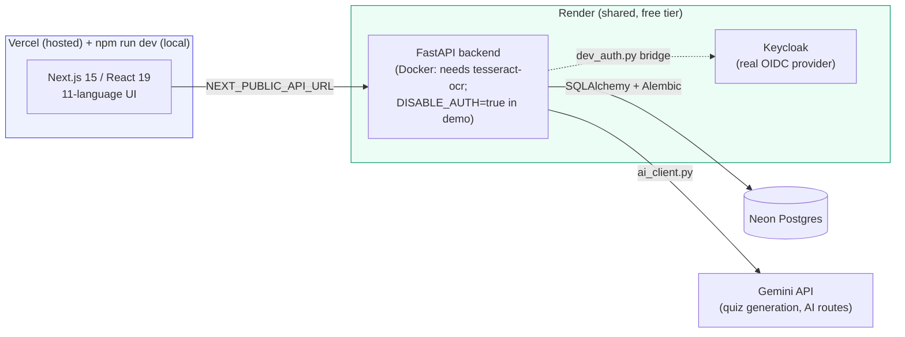
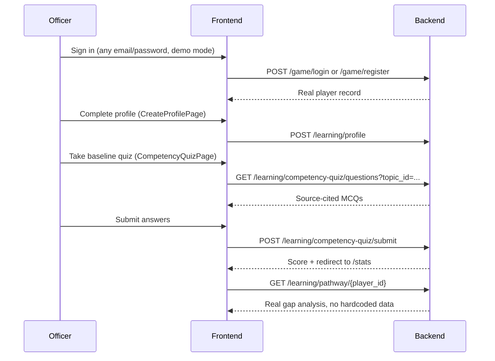
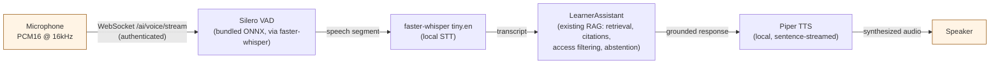

# PRISM — Personalized Readiness Intelligence & Skill Mapping

<div align="center">

**An 11-language, explainable competency-gap engine for government skill development — built for Smart India Hackathon 2026 (PS: 26101).**

[](https://github.com/Deltasthicc/PRISM/actions/workflows/ci.yml)
[](https://github.com/Deltasthicc/PRISM/actions/workflows/keepalive.yml)


-4169E1?logo=postgresql&logoColor=white)


[Live demo](#-live-demo) · [What it does](#-what-prism-actually-does) · [Architecture](#-architecture) · [Quizzes](#-quizzes) · [Adaptive Diagnostic](#-adaptive-diagnostic-two-stage-misconception-targeted) · [Live Quiz Sessions](#-live-quiz-sessions-qr-code-classroom-delivery) · [Trainer Review](#-trainer-review-edit-before-approve) · [DSA Sandbox](#-dsa-sandbox) · [Virtual Lab](#-virtual-lab-official-statistics) · [Recommended Learning](#-recommended-learning--igotnssta-enrollment) · [Exam Integrity](#-exam-integrity-webcam-proctoring) · [Learner Assistant (RAG)](#-learner-assistant-rag) · [Voice AI](#-voice-ai-pipeline) · [Admin Analytics](#-admin-analytics) · [Reliability hardening](#-reliability-hardening-from-a-real-audit) · [What's real vs. mockup](#-whats-real-and-whats-a-mockup) · [Local setup](#-running-it-locally) · [API](#-api-reference) · [Known limitations](#-known-limitations)

</div>

---

## 📖 What PRISM actually does

Government officers (MoSPI-style: statistical officers, analysts, policy staff) need a way to know exactly *which* skills they're missing, *why*, and *what to do about it* — without a vague "take this course" recommendation. PRISM is a **deterministic, explainable competency-gap engine**: it blends a learner's self-assessment with demonstrated performance (quiz results, exercises, real code submissions) at a fixed **65% demonstrated / 35% self-assessed** weighting, maps the result against a curated, government-source-cited competency catalog, and generates a personalized learning pathway (the "Prerequisite Pathways" map) with a plain-language rationale for every gap it identifies.

**Four curricula, 55 competencies**, each traceable to an actual government or standards document (see [`backend/services/competency_docs.py`](backend/services/competency_docs.py) and [`curricula.py`](backend/services/curricula.py)):
- DSA Fundamentals
- Official Statistics & Data Governance
- Public Policy
- Digital Literacy

The whole UI and the deterministic gap-analysis prose is available in **11 languages** — English, Hindi, and the next 9 most-spoken languages from the 2011 Census (Bengali, Marathi, Telugu, Tamil, Gujarati, Urdu, Kannada, Odia, Malayalam) — switchable live from the navbar, no page reload required. See [Internationalization](#-internationalization) for what's machine-translated vs. what still needs a native-speaker review pass.

## 🖥️ Live demo

- **Frontend (Vercel)**: [`https://prism-iota-azure.vercel.app`](https://prism-iota-azure.vercel.app) — the real, hosted app. Every push to `main` redeploys it automatically; every PR gets its own preview URL.
- **API (Render)**: `https://prism-backend-2voe.onrender.com`, backed by a Neon Postgres database and built from [`backend/Dockerfile`](backend/Dockerfile) (Docker, not Render's native buildpack — see [Deployment](#-deployment) for why).
- **Auth provider** (Keycloak, largely vestigial in demo mode — see [Auth model](#-auth-model-read-this-before-you-judge-the-security)): `https://prism-keycloak.onrender.com`

Running the frontend per-laptop via `npm run dev` still works too — the Vercel deployment is an additional, always-on option, not a replacement. A [`keepalive` workflow](.github/workflows/keepalive.yml) pings the Render services every 10 minutes so their free tier doesn't cold-start mid-demo (a cold Keycloak boot is 3–4+ minutes; Vercel's own hosting doesn't have this problem).

> Free-tier constraints apply on the Render side: cold starts on first request after idle, and Keycloak sits at roughly 90% of its 512MB memory cap. This is a hackathon demo environment, **not** a government-approved production deployment.

**Navigation is tuned to feel instant, not just work.** The frontend's shared React Query client previously had no default cache lifetime, so every route change re-fetched everything from scratch; it now caches appropriately (short-lived for live/changing data, longer for near-static reference data like curricula), most routes show an immediate loading skeleton instead of a blank screen while data resolves, and likely next-page navigation is prefetched ahead of the click.

## 🔐 Auth model — read this before you judge the security

The real thing exists and is untouched: OIDC token verification and role-based access control live in [`backend/security/identity.py`](backend/security/identity.py) and [`backend/security/rbac.py`](backend/security/rbac.py).

In front of it sits **one deliberate, clearly-labeled demo bypass** ([`backend/routes/authorization.py`](backend/routes/authorization.py)):

```python
_DEMO_AUTH_DISABLED = os.environ.get("DISABLE_AUTH", "").strip().lower() in {"1", "true", "yes", "on"}
```

When `DISABLE_AUTH=true` (the deployed demo's setting), every request is granted a synthetic principal with **every** role and skips per-player ownership checks — there's no real identity distinguishing one caller from another while this is set. This exists because the shared Keycloak instance's cold-start latency was making the full OIDC flow unreliable during live demos; a username alone is enough to act as that player. Unset it (the default) and full OIDC/RBAC verification is restored with **zero code changes** — nothing about the real auth path was weakened or removed, it's just bypassed for the demo.

A companion piece, [`routes/dev_auth.py`](backend/routes/dev_auth.py), bridges that demo username login to a *real* Keycloak-issued bearer token so `/learning/*` routes (which expect a genuine `BoundPrincipal`) work end-to-end while browsing locally. Its own docstring is explicit that this is **not** a login backdoor and **not** the real browser OIDC/PKCE flow — that flow is still open work.

**Never set `DISABLE_AUTH=true` for a deployment handling real user data.**

## 🏗️ Architecture



There's also a **separate, standalone second FastAPI app** at repo root (`services/`, distinct from `backend/services/`) — an optional AI microservice reachable via `AI_SERVICE_URL`. By default the backend runs self-contained and never needs it.

## 🧩 Quizzes

There are two genuinely separate, working quiz mechanisms — not one quiz reused everywhere:

1. **Competency quiz bank** ([`backend/routes/competency_quiz.py`](backend/routes/competency_quiz.py)) — **176 hand-authored questions** (both multiple-choice and fill-in-the-blank) across **22 topics** spanning all four curricula, servable either as a whole topic (onboarding baseline, `/baseline-assessment`) or scoped to exactly one competency (`/practice`, reached from a Prerequisite Pathways room — see [`frontend/lib/competencyTopics.js`](frontend/lib/competencyTopics.js) for the full topic list). Every question traces back to a real, hash-verified government document registered in [`document_corpus.json`](backend/data/document_corpus.json) — **51 source documents** in total, including official GATE CS/IT and Data Science & AI question papers (DSA), MoSPI/NSSO/Census/DST publications (Official Statistics), UPSC prelims papers, DARPG/NITI Aayog/DoPT documents (Public Policy), and MeitY/I4C/NIELIT material (Digital Literacy) — loaded via [`hand_authored_questions.py`](backend/services/hand_authored_questions.py). Every DSA competency now has at least one verified question.
2. **Grounded quiz generation** ([`learning_content.py`](backend/routes/learning_content.py), via [`quiz_generator.py`](backend/services/quiz_generator.py)) — upload your own material from the Academy page and get back a fresh MCQ set with an exact source citation for every answer, with a local fallback generator when no Gemini key is configured. Supported formats: `.txt`, `.md`, `.pdf`, `.docx`, `.pptx`, `.vtt`/`.srt`/`.transcript`, audio/video (`.mp3`/`.wav`/`.mp4`/`.mov`/`.webm`, transcribed locally via `faster-whisper`), and now **`.png`/`.jpg`/`.jpeg` images plus scanned PDFs** — see [Document ingestion & OCR](#-document-ingestion--ocr) below.

Both the competency quiz and the DSA Sandbox write to the same `AccuracyHistory` table that drives Prerequisite Pathways room unlocking — finishing either kind of real practice moves the map forward, for every course and topic.

### 📠 Document ingestion & OCR

Every format above is parsed by one bounded ingestion engine ([`backend/ai/ingestion.py`](backend/ai/ingestion.py)) — no arbitrary code execution, hard per-format size/page/slide caps, and zip-bomb guards on DOCX/PPTX/image uploads:

- **A photographed page or scanned/legacy statistical table now actually extracts text.** A PDF page with no text layer is rendered via [PyMuPDF](https://pymupdf.readthedocs.io/) and OCR'd with [Tesseract](https://github.com/tesseract-ocr/tesseract) (`pytesseract`); a directly-uploaded image goes through the same OCR path. This closes what was previously the platform's biggest content-ingestion gap versus rival SIH26101 submissions that already handled scanned documents.
- **Honest degradation, never silent data loss** — if some pages have a real text layer and others need OCR, the readable pages still come through with an inline note on which page numbers couldn't be read; if the OCR engine itself is unavailable in a given environment (the `tesseract` binary missing), that's reported as a clear error rather than the document silently looking empty.
- **Why the backend runs on Docker now**: `pytesseract` only wraps the real `tesseract` binary — it isn't bundled with the pip package, and Render's native Python buildpack has no way to `apt-get install` it. [`backend/Dockerfile`](backend/Dockerfile) installs `tesseract-ocr` at build time; `render.yaml`'s `prism-backend` service builds from it instead of a plain `pip install`.



## 🎯 Adaptive Diagnostic (two-stage, misconception-targeted)

A real two-stage diagnostic ([`backend/services/adaptive_diagnostic.py`](backend/services/adaptive_diagnostic.py), [`backend/routes/adaptive_diagnostic.py`](backend/routes/adaptive_diagnostic.py), `/adaptive-diagnostic` in the frontend) — not a second copy of the competency quiz:

- **Stage 1** serves a balanced spread of items across the learner's curriculum to find where they're actually weak, using the same real, hand-authored question bank the competency quiz draws from — no separate/duplicated content.
- **Stage 2 targets the specific misconception behind a stage-1 miss**, not just "more questions on the same topic". [`backend/data/misconception_tags.json`](backend/data/misconception_tags.json) is a curated mapping of real question `item_id`s to real misconception categories (e.g. `sampling-design-tradeoff-confusion`, `dpdp-definition-scope-underestimation`) built by reading each question's actual distractors — most tags are honestly single-item where no genuine cluster of related items exists, rather than inflating apparent coverage with generic labels.
- **Honestly unavailable when there's no real signal** — if stage 1 doesn't surface a specific misconception (e.g. the learner did fine, or missed items with no shared tag), stage 2 says so rather than serving an arbitrary follow-up quiz.
- Both stages write through the same `_record_evidence()` path as everything else — `AccuracyHistory` + `EvidenceRecord(evidence_type="observed_practice")` — so a diagnostic session moves Prerequisite Pathways exactly like any other real practice.

## 📡 Live Quiz Sessions (QR-code classroom delivery)

A real, host-paced group quiz session ([`backend/models/live_session.py`](backend/models/live_session.py), [`backend/routes/live_sessions.py`](backend/routes/live_sessions.py), `/host-session` + `/join/[joinCode]` in the frontend) — the classroom/training-hall delivery mode competing submissions in this space already ship:

- **A trainer hosts, a group joins by 6-character code or QR** (rendered client-side via the `qrcode` package) — no lookalike-character confusion, the code alphabet excludes `0`/`O`/`1`/`I`.
- **The host controls pacing** — `start`, `advance` (next question), and `end` are host-only actions; participants answer whatever question index is currently live, and a stale-question answer is rejected rather than silently accepted.
- **Real, weighted scoring** — session end computes each participant's score using the same `DIFFICULTY_WEIGHT`/`time_factor` algorithm ([`backend/services/quiz_scoring.py`](backend/services/quiz_scoring.py)) every other quiz mechanism uses (with an honest neutral time factor, since a live session doesn't track individual per-question timing), and writes one real `GeneratedQuizAttempt` per participant — not a separate, disconnected leaderboard.
- **A real, persisted leaderboard** — `GET /learning/live-sessions/{id}/results` only returns results after the host ends the session, so no one sees a live/partial ranking mid-quiz.

## ✍️ Trainer Review (edit-before-approve)

Trainer review of AI-generated quiz content ([`backend/routes/quiz_review.py`](backend/routes/quiz_review.py), `/trainer-review` in the frontend) is no longer approve-or-reject only:

- A trainer can now **edit question text, options, the correct answer, and the explanation** before approving — not just accept an AI-generated question as-is or throw it away.
- **The source excerpt itself is deliberately not editable** — it's validated server-side to exactly match the original on submit (a 422 if it's been changed), so a trainer can refine the question but can't quietly rewrite what the AI was actually shown or claimed to cite.

## 📊 Admin Analytics

`GET /learning/admin/overview` ([`backend/routes/learning_analytics.py`](backend/routes/learning_analytics.py), `/admin` in the frontend) covers more than a point-in-time snapshot:

- **Training effectiveness** — for each player/competency with at least two `CompetencyAssessment` records, the real earliest-vs-latest score delta, ranked by magnitude (top 8) — a genuine before/after measurement, not a synthetic trend line.
- **Course completion** — SQL-aggregated directly from real `CourseEnrollment` rows (see [Recommended Learning](#-recommended-learning--igotnssta-enrollment)).
- **Activity trend** — real weekly activity counts only; a week with no real activity is never zero-padded to look like a continuous series, and there is deliberately no fabricated "hours spent" metric where no real signal for it exists.
- **Emerging skill gaps** — competencies whose miss-frequency is rising between the earlier and later half of a player's assessment history, surfaced as a real, ranked signal rather than a hardcoded "trending" list.

## 🧮 DSA Sandbox

A real coding workspace for the DSA Fundamentals curriculum ([`frontend/app/dsa-sandbox/`](frontend/app/dsa-sandbox/), [`backend/routes/dsa_sandbox.py`](backend/routes/dsa_sandbox.py)):

- **A real CodeMirror 6 editor** — syntax highlighting, line numbers, bracket matching, autocomplete, folding, four-space indentation, `Ctrl`/`Cmd`+`Enter` to run.
- **22 original problems** across every DSA topic (arrays, linked lists, trees, graphs, DP, sliding window, hashing, two pointers, backtracking, intervals, matrices, prefix sums, and more), each with two worked examples, constraints, and a collapsible solution outline.
- **Five real languages** — Python, JavaScript, Java, C++, C# — generated once per problem from shared type metadata ([`services/dsa_lang_gen.py`](backend/services/dsa_lang_gen.py)), not hand-duplicated five times.
- **A real judge, not a simulated pass/fail** — every submission runs against the public [Judge0](https://ce.judge0.com) API. Hidden test cases stay server-side.
- Solving a problem writes real practice evidence into the same `AccuracyHistory` row Prerequisite Pathways reads — a DSA Sandbox submission unlocks the map exactly like a competency quiz does.

## 🧪 Virtual Lab (Official Statistics)

A bounded, hands-on sampling-design lab ([`frontend/app/sampling-lab/`](frontend/app/sampling-lab/), [`backend/labs/sampling_lab.py`](backend/labs/sampling_lab.py), [`backend/routes/sampling_lab.py`](backend/routes/sampling_lab.py)):

- **Real sample-size calculation tasks** — simple random sampling, finite population correction, and proportional allocation across strata, each with a genuine numeric answer recomputed server-side from a fixed formula (not an LLM-judged free-text answer).
- **Deterministic, worked feedback** — every submission (right or wrong) gets back the step-by-step calculation, not just a verdict, so a wrong answer is still a learning moment.
- **No learner code execution, ever** — a learner submits one bounded number per task; there is no code path from a submission to anything running on the API host.
- A correct submission writes real practice evidence into `AccuracyHistory` for `os_sampling_design` — the same table Prerequisite Pathways reads, so lab completions move the map exactly like a competency quiz or DSA Sandbox submission does.
- This lab existed, fully built and unit-tested, before it had a route or a frontend page — found and wired up as part of closing out the platform for the demo. Scoped to one Official Statistics competency for now, not the full AI/Data Science/Cloud/Cybersecurity/Automation lab set a from-scratch build would eventually cover.

## 🎓 Recommended Learning & iGOT/NSSTA enrollment

Every tracked skill gap gets real, ranked course recommendations, and a learner can actually act on them — not just look at a list ([`frontend/components/RecommendedCourses.jsx`](frontend/components/RecommendedCourses.jsx), [`backend/services/learning_catalog.py`](backend/services/learning_catalog.py), [`backend/routes/course_enrollment.py`](backend/routes/course_enrollment.py)):

- **Real, gap-ranked recommendations** — `recommend_courses()` takes the same severity-ranked skill gaps `/stats` and Prerequisite Pathways already use and, for each of the top 5, returns one **iGOT Karmayogi** course, one **NSSTA TPAC** training entry, and one **in-app practice** link — directly answering PS-26101's "personalized learning recommendations of iGOT Course Module as well as NSSTA's TPAC recommended Training Programme" requirement.
- **A real, persisted enroll → complete lifecycle**, not a dead link — `POST /learning/catalogue/enroll` and `POST /learning/catalogue/enrollments/{id}/complete` write and update an actual `course_enrollments` row per learner, idempotently (enrolling twice, or completing twice, is a no-op, not a duplicate).
- **Honestly simulated, never pretending to be live** — `igot`/`nssta` enrollment goes through `SimulatedIGOTAdapter`, which always reports `status: "SIMULATED"` (see [Known limitations](#-known-limitations) — no real iGOT/NSSTA API contract exists yet to integrate against). What's real is everything on PRISM's side of that boundary: the ranking, the persistence, the idempotency, and the lifecycle.
- **No fabricated competency claims** — completing a course writes an `EvidenceRecord` with `evidence_type="provider_imported"`, a type `learning_engine.py` deliberately excludes from competency scoring (`UNSCORED_EVIDENCE_TYPES`). A simulated provider signal is recorded for transparency, never used to inflate a skill level that hasn't actually been demonstrated.
- In-app practice recommendations have no enrollment step — they're a direct link into `/dungeon`'s adaptive quest for that competency, since there's nothing to "enroll" in beyond visiting the page.

## 🛡️ Exam Integrity (Webcam Proctoring)

A real, on-device webcam integrity monitor for the baseline assessment ([`frontend/components/ProctoringMonitor.jsx`](frontend/components/ProctoringMonitor.jsx), [`backend/routes/proctoring.py`](backend/routes/proctoring.py)) — opt-in, and never a pass/fail gate:

- **Real client-side ML, not a mockup indicator** — [`@tensorflow-models/blazeface`](https://github.com/tensorflow/tfjs-models/tree/master/blazeface) checks face count (flags zero or multiple faces) and [`@tensorflow-models/coco-ssd`](https://github.com/tensorflow/tfjs-models/tree/master/coco-ssd) checks for a `cell phone` in frame, both real pretrained models run entirely in the browser via `@tensorflow/tfjs`. Two non-camera browser signals (tab switch, fullscreen exit) run alongside them.
- **No video or image is ever sent to the backend** — only the resulting event (`no_face_detected`, `multiple_faces_detected`, `phone_detected`, `tab_switch`, `fullscreen_exit`, plus a confidence score for phone detection) is persisted, to a real `proctoring_events` table via `POST /learning/proctoring/violations`.
- **Explicit opt-in, off by default** — no camera is requested until the learner flips the toggle themselves; camera denial is handled gracefully and never blocks the exam.
- **An audit signal, never a score** — a continuously-true condition is debounced (re-reported at most once per 20s) so the count reflects distinct incidents, not poll noise. The completed-report view shows a plain "N integrity signals recorded" breakdown for a human reviewer to weigh; violations have zero effect on grading, competency scoring, or whether Submit is enabled.
- Directly answers PS-26101's exam-integrity requirement — matches the class of feature competing SIH26101 submissions ship, without pretending server-side certainty a lightweight client-side classifier can't honestly claim (see [Known limitations](#-known-limitations)).

## 🤖 Learner Assistant (RAG)

A real, access-filtered, cited retrieval engine ([`backend/ai/retrieval.py`](backend/ai/retrieval.py), [`ai/assistant.py`](backend/ai/assistant.py), exposed at `/assistant` in the frontend) — not a general-purpose chatbot, and it says so:

- **Real BM25 retrieval** over a real corpus: at backend startup, [`ai/seed_corpus.py`](backend/ai/seed_corpus.py) indexes all 176 hand-authored questions' `source_excerpt` fields — already-committed, human-reviewed quotes from real government documents — into an in-memory chunk store. No network fetch needed, so this works identically on a fresh clone.
- **Pre-retrieval access filtering** by tenant and role, before ranking — a chunk a caller isn't allowed to see is never scored, not just hidden after the fact.
- **Honest abstention** — if nothing retrieved clears the relevance threshold, the assistant says so explicitly (`insufficient_evidence`) instead of inventing an answer.
- **Every answer carries citations** — source document id, a real locator (page/section), and the exact quoted passage the answer is grounded in.
- **Graceful LLM degradation** — with a working `GEMINI_API_KEY`, the top evidence is handed to Gemini for a synthesized, still-grounded answer; without one (or on an API error), it falls back to a deterministic extractive answer quoting the top-matching evidence directly, rather than failing.
- Prompt-injection detection runs on every query before retrieval even starts.

## 🛡️ Reliability hardening (from a real audit)

The deployed app was put through a real functional audit and a bounded concurrent-load test against its own live Render/Neon/Vercel stack (not a staging copy) — registering real accounts, submitting real answers, and firing genuine concurrent traffic at the production API. Two real bugs came out of it and were fixed the same way everything else in this README claims to be real: reproduced, root-caused, fixed, regression-tested.

- **Concurrent registrations were failing under load.** 25 simultaneous `POST /game/player/create` calls (unique usernames) produced HTTP 500s on 8 of them (32%) — a genuine check-then-insert race in `create_player` (two concurrent requests for the same not-yet-taken username could both pass the pre-check before either committed) plus an un-tuned SQLAlchemy connection pool (the code's own long-standing comment had flagged pool sizing as deferred, waiting on exactly this kind of production number). Fixed: the commit's `IntegrityError` is now caught and converted to the same clean 400 a non-concurrent duplicate already gets, and the pool is explicitly sized. Re-verified live afterward: 25/25 concurrent registrations succeed, and 10 concurrent requests for the *identical* username correctly give 1 success + 9 clean 400s + 0 crashes.
- **A single correct answer could claim a room was "MASTERED."** `recent_accuracy` is a rolling average over at most the last 5 attempts, so after exactly one answer it's necessarily 0% or 100% — while `/stats`'s own gap-analysis copy, looking at the identical evidence, hedges it as "provisional, low confidence." Fixed: accuracy-based mastery now needs at least 3 real attempts on a topic before the label fires; damage-based mastery (clearing a room's real `enemy_count` in Quest Mode combat) is untouched, since that already requires multiple correct answers.
- Two smaller fixes from the same pass: `/sampling-lab` now shows a real loading state while its task list fetches (it previously rendered an empty, indicator-free form shell during that wait); the baseline assessment now warns via the browser's native confirmation before a tab close, refresh, or typed-URL navigation would silently discard in-progress answers (in-app `<Link>` navigation isn't covered yet — Next's App Router has no route-change-block hook for that).
- **What the same audit checked and did *not* find a bug in**, worth recording so it isn't re-litigated: the QR live-session results/leaderboard (independently reproduced twice, host-only and host+participant, both showing correct real scores), and registering an already-taken username (intentionally logs the caller into the existing account instead of erroring — there's no password in this demo mode to check, so treating it as "welcome back" is deliberate, not a data-integrity gap).

## ✅ What's real, and what's a mockup

Being honest about this line is the point of this section — the frontend has a real split between pages backed by the actual engine and pages that are still visual placeholders for the demo narrative.

| Route | Status |
|---|---|
| `/login` → `/register` → `/baseline-assessment` | **Real.** Resolves an actual backend player via `useAuthStore`, then a real profile form, then a source-cited baseline quiz served by `routes/competency_quiz.py`, with an opt-in real webcam integrity monitor — see [Exam Integrity](#-exam-integrity-webcam-proctoring). |
| `/stats` | **Real.** Every number comes from `GET /learning/pathway` — no hardcoded competency data, including the recommended-courses list — see [Recommended Learning](#-recommended-learning--igotnssta-enrollment) below. |
| `/dungeon` ("Prerequisite Pathways") | **Real, for all four curricula.** Driven by `GET /learning/pathway/{player_id}` (the same engine `/stats` uses) merged with real per-player room unlock status from `GET /game/dungeon/{id}`. "Practice this competency" opens `/practice`, a plain quiz scoped to that one competency; finishing it updates `AccuracyHistory`, which is what flips a room to unlocked/weak/mastered and advances the "biggest gap" pointer — verified live across every curriculum, not just DSA. "Mastered" now requires at least 3 real attempts on that topic (accuracy-based) or clearing the room's real enemy count (combat-based) — see [Reliability hardening](#-reliability-hardening-from-a-real-audit). |
| `/dsa-sandbox` | **Real.** See [DSA Sandbox](#-dsa-sandbox) below — real code, a real Judge0 judge, no simulated pass/fail. |
| `/sampling-lab` | **Real.** See [Virtual Lab](#-virtual-lab-official-statistics) below — bounded, deterministic sample-size tasks, no learner code execution. |
| `/assistant` | **Real.** Text and voice chat are now one page with a mode toggle (previously two separate nav tabs) — see [Learner Assistant (RAG)](#-learner-assistant-rag) and [Voice AI pipeline](#-voice-ai-pipeline) below; `/voice` now redirects here. |
| `/quiz` (Source Quiz Generator) | **Real.** Upload your own material — including scanned documents/images now — and get back a real generated quiz — see [Quizzes](#-quizzes) and [Document ingestion & OCR](#-document-ingestion--ocr) above. |
| `/adaptive-diagnostic` | **Real.** See [Adaptive Diagnostic](#-adaptive-diagnostic-two-stage-misconception-targeted) above. |
| `/host-session`, `/join/[joinCode]` | **Real.** See [Live Quiz Sessions](#-live-quiz-sessions-qr-code-classroom-delivery) above. |
| `/trainer-review` | **Real**, now with edit-before-approve — see [Trainer Review](#-trainer-review-edit-before-approve) above. |
| `/academy`, `/register`, `/dashboard`, `/admin` | **Real.** Backed by live API calls (`learning.*` / `game.*`) — `/admin` includes real training-effectiveness, course-completion, activity-trend, and emerging-skill-gap analytics, see [Admin Analytics](#-admin-analytics) above. |
| `/character`, `/combat/[roomId]`, `/boss/[dungeonId]`, `/leaderboard` | **Real, but gated behind Quest Mode.** Off by default — visiting directly shows `QuestModeGate` (a "turn on Quest Mode?" prompt) until the learner opts in from the NavBar toggle. Once on, these render genuine player/game state (hint tokens, damage, hero selection, XP-ranked leaderboard) on top of the same real competency-quiz question bank. Leaderboard's heading reads "ALL-TIME RANKS" — the backend ranks by lifetime `total_xp`, no weekly window exists. |
| `/guild` | **Gated behind Quest Mode, and still a self-contained mockup underneath.** The real backend endpoints it should call (`/game/guild/raid/join`, `/raid/status`) exist and work — `joinGuildRaid()` in `frontend/lib/api/client.js` is correctly wired — but nothing in the UI calls it yet; it's disconnected working infrastructure for a legitimately future feature, not fake code. |
| `/integration-registry` | **Still a mockup**, but its copy was fixed for honesty — it used to assert specific, never-checked compliance claims ("VERIFIED COMPLIANT", a fabricated audit hash, a specific RTI Act citation); now framed explicitly as "design-intent, not measured." |

## 🌐 Internationalization

**11 languages**: English, Hindi, Bengali, Marathi, Telugu, Tamil, Gujarati, Urdu, Kannada, Odia, Malayalam — the 2011 Census's top 10 most-spoken mother tongues, plus English.

- [`frontend/lib/i18n/translations.js`](frontend/lib/i18n/translations.js) — one dictionary per language, ~280 keys each (nav, login, academy, stats, radar, admin, dashboard, leaderboard, character, DSA Sandbox, Learner Assistant, footer, and more). Adding a language needed **zero code changes** — [`LanguageContext.jsx`](frontend/lib/i18n/LanguageContext.jsx) and [`LanguageSwitcher.jsx`](frontend/components/LanguageSwitcher.jsx) were already fully generic over whatever languages this file lists.
- [`frontend/lib/i18n/LanguageContext.jsx`](frontend/lib/i18n/LanguageContext.jsx) — a `useLanguage()` hook, persisted to `localStorage`, with a `hasOwnProperty`-guarded lookup (deliberately hardened against prototype pollution) and fallback to English for any missing key or language.
- The backend also honors `?lang=` (all 11 codes) on `/learning/curricula`, `/learning/pathway/{id}`, `/learning/assessment/{id}`, `/learning/integrations/status`, and `/learning/admin/overview`, translating both the curated curriculum catalog (`curricula_<lang>.json` per language) and the deterministic gap-analysis prose generated by `learning_engine.py`.
- Scope is intentionally UI chrome + deterministic system text, **not** AI-generated content — quiz questions and Gemini-generated text come back in whatever language they were generated in.
- **Translation provenance matters here**: Hindi's content was hand-translated. Every other language (Bengali through Malayalam) was machine-translated via [`backend/i18n_pipeline/`](backend/i18n_pipeline/) — Google Translate's public endpoint, with MyMemory as a fallback when rate-limited — never by an LLM or by hand. That pipeline is documented and re-runnable, but its output is a first pass: **a fluent native-speaker review is still an open item** for those 9 languages, same standard already applied before trusting Hindi.

The same competency-radar page, switched live from the navbar with no reload (English/Hindi shown as a two-language sample of the full 11-language set):

| English | हिंदी |
|---|---|
| `Skill Vector Divergence`, `11 tracked competencies`, `not yet assessed` | `स्किल वेक्टर विचलन`, `11 ट्रैक की गई दक्षताएं`, `अभी तक मूल्यांकन नहीं` |
| Curriculum picker: `DSA Fundamentals` | पाठ्यक्रम चयनकर्ता: `DSA मूल बातें` |
| Footer: `© 2024 Ministry of Statistics and Programme Implementation (MoSPI)` | फुटर: `© 2024 सांख्यिकी और कार्यक्रम कार्यान्वयन मंत्रालय (MoSPI)` |

## 🎙️ Voice AI pipeline

A fully local, authenticated voice interface to the learning assistant — no audio ever leaves the machine, and nothing is written to disk ([`backend/ai/voice/`](backend/ai/voice/), [`routes/ai_voice.py`](backend/routes/ai_voice.py)):



- Server-derived identity only — `tenant_id`, `user_id`, `player_id`, and `roles` sent by the client are rejected outright; the same tenant/role-scoped RAG filtering and prompt-injection detection used by the text-based assistant applies here too.
- Cooperative cancellation and barge-in: a learner can interrupt mid-response.
- **TTS synthesis is local-only for now** — the Piper voice model isn't committed to the repo (`.gitignore`'d, configured via `PIPER_MODEL_PATH`/`PIPER_CONFIG_PATH`), so spoken replies aren't part of the hosted demo; it runs when you bring your own model file locally. STT (speech-to-text) works out of the box anywhere the backend runs.
- **`/assistant`**: text and voice are one page with a mode toggle (previously two separate nav tabs, `/assistant` and `/voice`; `/voice` now just redirects here). Voice mode captures mic audio, resamples to 16kHz mono PCM16 client-side (Web Audio API), streams it over the WebSocket above, and renders the live transcript plus the same grounded/cited answer text mode shows. Handles barge-in and a denied/unavailable microphone with a clear error. `DISABLE_AUTH=true` now covers this endpoint too (it previously had no demo bypass at all, unlike every other route, so voice could never connect in this app's normal local/demo setup).
- **TTS needs a local Piper model you bring yourself** (see below) -- without one, the server honestly reports `TTS_FAILURE` per turn and the page shows the real text answer with a "voice reply unavailable" note, rather than pretending to speak. STT works out of the box (`faster-whisper`'s `tiny.en` model downloads automatically on first use).
- Verified with a real spoken sentence fed through the actual WebSocket protocol end-to-end: real VAD speech-start/end, a real `faster-whisper` transcript, a real RAG-grounded answer with citations, and an honest `TTS_FAILURE` with no Piper model configured. Live microphone capture through a real browser was not part of that verification (see Known limitations).

### Whisper domain fine-tuning (trained and measured — real WER improvement)

Stock `faster-whisper tiny.en` measurably mis-transcribes this project's own domain vocabulary — confirmed on clean, synthesized speech with two different TTS voices (e.g. "DARPG Sevottam" comes back as "dark, sevetam"). [`backend/scripts/voice_finetuning/`](backend/scripts/voice_finetuning/) is a complete fine-tuning pipeline for this: extract real domain text from the curricula and question bank → synthesize training audio across several Piper voices → fine-tune `openai/whisper-tiny.en` with HuggingFace `transformers` → evaluate WER against the stock baseline → convert to CTranslate2 and drop it in via `ai/voice/stt.py`'s `WHISPER_MODEL_PATH` env var, no code change needed. The full pipeline has been run end-to-end on a real GPU (RTX 5090): **36.7% → 28.8% WER on held-out validation, a 21–22% relative improvement**, confirmed reproducible across two independent training runs. The resulting model is not committed to the repo (it's a machine-specific build artifact, same as the Piper voice model) — anyone can reproduce it by following [the pipeline's README](backend/scripts/voice_finetuning/README.md).

## 🚀 Running it locally

**Backend** (Python 3.11 — pinned in `render.yaml` and `backend/.python-version`; newer versions fail to build `pydantic-core` from source):

```bash
cd backend
python -m venv .venv
.venv\Scripts\activate      # or: source .venv/bin/activate
pip install -r requirements.txt
copy .env.example .env      # fill in DATABASE_URL at minimum; DISABLE_AUTH=true for a quick local demo
python -m alembic upgrade head
uvicorn main:app --reload --port 8000
```

**Frontend** (Node ≥ 22.13):

```bash
cd frontend
npm install
echo NEXT_PUBLIC_API_URL=http://localhost:8000 > .env.local
npm run dev
```

Then open `http://localhost:3000`.

## 📡 API reference

| Router | Prefix | Purpose |
|---|---|---|
| `game.py` | `/game` | Player creation/login, hero selection, sessions, leaderboard, hint tokens |
| `learning_profile.py` | `/learning` | Learner profile CRUD |
| `learning_competency.py` | `/learning` | Competency assessment, pathway, curricula listing |
| `learning_content.py` | `/learning` | Quiz/content generation and listing |
| `learning_integration.py` | `/learning` | External catalog (iGOT/NSSTA) integration status |
| `course_enrollment.py` | `/learning/catalogue` | Real enroll/complete lifecycle for recommended iGOT/NSSTA courses — see [Recommended Learning](#-recommended-learning--igotnssta-enrollment) |
| `learning_analytics.py` | `/learning` | Admin overview & analytics — see [Admin Analytics](#-admin-analytics) |
| `adaptive_diagnostic.py` | `/learning/diagnostic` | Two-stage, misconception-targeted diagnostic — see [Adaptive Diagnostic](#-adaptive-diagnostic-two-stage-misconception-targeted) |
| `live_sessions.py` | `/learning/live-sessions` | QR-code/join-code live group quiz sessions — see [Live Quiz Sessions](#-live-quiz-sessions-qr-code-classroom-delivery) |
| `quiz_review.py` | — | Trainer approve/reject/edit for AI-generated quizzes — see [Trainer Review](#-trainer-review-edit-before-approve) |
| `competency_quiz.py` | `/learning/competency-quiz` | Source-cited competency quiz bank — by topic (baseline) or by a single `competency_id` (`/practice`) |
| `dsa_sandbox.py` | `/learning/dsa-sandbox` | Real Judge0 code execution — see [DSA Sandbox](#-dsa-sandbox) |
| `sampling_lab.py` | `/learning/sampling-lab` | Bounded sample-size calculation tasks — see [Virtual Lab](#-virtual-lab-official-statistics) |
| `proctoring.py` | `/learning/proctoring` | Real, persisted webcam/browser exam-integrity signal log — see [Exam Integrity](#-exam-integrity-webcam-proctoring) |
| `dev_auth.py` | `/auth` | Local-dev bridge: demo login → real Keycloak token (not a backdoor, not the real OIDC flow) |
| `ai_real.py` | `/ai` | Learner Assistant (`/ai/assistant/query`), retrieval (`/ai/retrieval/search`, `/ai/retrieval/index`) — see [Learner Assistant (RAG)](#-learner-assistant-rag) |
| `ai_voice.py` | `/ai/voice` | Authenticated WebSocket voice pipeline (`/ai/voice/stream`) — see [Voice AI pipeline](#-voice-ai-pipeline) |

`learning.py` aggregates the `learning_*` routers into one `APIRouter` for a single import point. Full OpenAPI contract: [`docs/contracts/openapi.json`](docs/contracts/openapi.json).

## 🧱 Tech stack

| Layer | Choice |
|---|---|
| Backend | FastAPI 0.141, Starlette 1.6, SQLAlchemy 2.0, Alembic, Uvicorn |
| Database | PostgreSQL (Neon, serverless) |
| Auth | Keycloak (OIDC), demo-bypassable per above |
| AI | Gemini (`gemini-flash-lite-latest`) |
| Document ingestion | pypdf, python-docx, stdlib PPTX parsing, PyMuPDF + Tesseract (`pytesseract`) for OCR — see [Document ingestion & OCR](#-document-ingestion--ocr) |
| Voice | faster-whisper 1.2.1 (STT), piper-tts 1.8.0 (TTS), Silero VAD (bundled ONNX) — all local |
| Frontend | Next.js 15, React 19, Zustand, TanStack Query, Recharts, React Flow, Framer Motion, Tailwind CSS |
| Deployment | Vercel (frontend), Render (Blueprint: backend as Docker + Keycloak), Neon (DB) |
| CI | GitHub Actions — see below |

## 🧪 Tests & CI

- **1,102 backend tests** (1,102 passed, 25 skipped locally; pytest), run against a real `postgres:16` service container in CI. Includes a deterministic regression test for the concurrent-registration race described in [Reliability hardening](#-reliability-hardening-from-a-real-audit) — it forces the exact interleaving rather than relying on real thread timing, and fails with the actual `IntegrityError` against the pre-fix code.
- **No frontend test suite** exists yet — `frontend/package.json` only defines `dev`/`build`/`start`/`lint`.
- [`ci.yml`](.github/workflows/ci.yml) runs on every push/PR to `main`:
  - `backend-tests` — `pip-audit` + full pytest suite against Postgres (installs `tesseract-ocr` first, so the OCR tests run against the real binary, not a mock)
  - `frontend-checks` — lint + production build
  - `contract-checks` — validates `docs/contracts/openapi.json`
  - `security-checks` — `gitleaks` secret scan
  - `sast` — Semgrep, with one rule exception documented inline for two reviewed call sites in `backend/db/database.py`
- [`keepalive.yml`](.github/workflows/keepalive.yml) — cron every 10 minutes, keeps the free-tier Render services warm.

Not yet covered: end-to-end/Playwright smoke tests, SBOM, DAST.

## ☁️ Deployment

- **Frontend**: hosted on **Vercel** (zero-config Next.js deploy, Root Directory set to `frontend`), auto-deploying `main`. `render.yaml` also still defines an optional `prism-frontend` Render service (`next start`, Node 22.13 pinned) — an alternative hosted copy, not the primary one; running per-laptop via `npm run dev` works exactly as before either way.
- **Backend**: [`render.yaml`](render.yaml) is a Render Blueprint defining `prism-backend` (now built from [`backend/Dockerfile`](backend/Dockerfile), not Render's native Python buildpack — needed once OCR required the real `tesseract` binary, see [Document ingestion & OCR](#-document-ingestion--ocr)) and `prism-keycloak` (Docker). The Neon database is **not** part of this blueprint and is provisioned separately.
- **CORS**: `FRONTEND_ORIGINS` (exact-match list) covers local dev ports and the stable Vercel production alias; `main.py`'s `FRONTEND_ORIGIN_REGEX` (default `^https://prism-[a-z0-9-]+\.vercel\.app$`) additionally trusts every one of this project's own Vercel preview-deployment subdomains by pattern, so a new PR preview never needs a manual CORS edit.
- See [`deploy/README.md`](deploy/README.md) for the full Render/Neon setup walkthrough.

## ⚠️ Known limitations

- `DISABLE_AUTH=true` in the deployed demo means there is no real identity check on any request — see [Auth model](#-auth-model-read-this-before-you-judge-the-security).
- `/integration-registry` is a visual mockup with no backend behind it; `/guild` has a real backend endpoint waiting but no UI wired to it yet.
- iGOT/NSSTA course enrollment ([Recommended Learning](#-recommended-learning--igotnssta-enrollment)) is a real, persisted lifecycle on PRISM's side, but the provider itself is `SimulatedIGOTAdapter` — no real iGOT Karmayogi or NSSTA API contract exists to integrate against yet, so "enroll"/"complete" never leave this app.
- The optional gamified practice layer (Quest Mode: `/character`, `/combat`, `/boss/[dungeonId]`, `/guild`, `/leaderboard`) is off by default and intentionally not part of the front-page pitch for now — see the [real-vs-mockup table](#-whats-real-and-whats-a-mockup) if you need the detail.
- The Learner Assistant's answer quality without a working `GEMINI_API_KEY` is extractive (it quotes the top-matching evidence directly rather than synthesizing prose) — real and honestly labeled, but a configured key gives noticeably better answers. The 176-excerpt seed corpus is UPSC-exam-style passages, so some phrasing reads more like an exam question than a textbook explanation.
- The voice pipeline's voice mode (inside `/assistant`, formerly the standalone `/voice` page) is real but has two real constraints: TTS output needs a local Piper model you supply yourself (STT and the text answer work without one), and live microphone capture through a real browser has not been verified in this development environment (no physical microphone available here) — the WebSocket protocol itself was verified end-to-end with a real generated speech sample. See [Voice AI pipeline](#-voice-ai-pipeline).
- The Whisper domain fine-tune (see above) has been trained and measured (21–22% relative WER improvement on held-out validation), but the resulting model file isn't bundled with the repo — `WHISPER_MODEL_PATH` needs to point at your own locally-trained output (or the stock model is used, which still works, just with the known domain-vocabulary mis-transcriptions).
- 9 of the 11 UI languages are a first machine-translation pass awaiting native-speaker review — see [Internationalization](#-internationalization).
- The real browser OIDC/PKCE login flow (as opposed to the demo bypass and the dev-login bridge) is not yet implemented.
- Webcam proctoring ([Exam Integrity](#-exam-integrity-webcam-proctoring)) runs a real but lightweight pretrained classifier (`blazeface`/`coco-ssd`), not a purpose-trained exam-proctoring model — expect real false positives (poor lighting, an object that looks phone-like) and false negatives (a phone held out of frame). That's exactly why it's designed as an audit signal for a human reviewer rather than an automatic pass/fail; a production deployment would want a higher-fidelity, purpose-built model and a documented false-positive rate before treating it as more than that.
- No frontend automated test suite.
- Render's free tier means cold starts and tight memory headroom on Keycloak — not a production-scale deployment. The Vercel-hosted frontend does not have this cold-start problem.
- OCR ([Document ingestion & OCR](#-document-ingestion--ocr)) uses Tesseract's default English-language data only — accuracy on non-English scanned text, handwriting, or low-quality scans is unverified and expected to be weaker than on clean printed English text. It's a real fallback for the "no text layer at all" case, not a purpose-tuned document-scanning product.
- `backend/requirements.lock` is a standalone dependency-audit artifact and is currently stale relative to the OCR packages (`pymupdf`, `pytesseract`, `Pillow`) added to `requirements.txt` — nothing installs from the lock file today (CI, Render, and the Dockerfile all use `requirements.txt`/`requirements-dev.txt`), so this doesn't affect what's actually deployed, but it should be regenerated.
- The baseline assessment's unsaved-progress warning ([Reliability hardening](#-reliability-hardening-from-a-real-audit)) only covers tab close, refresh, and typed-URL navigation — clicking a NavBar tab mid-assessment still silently discards progress with no warning, since intercepting in-app client-side route changes would need cross-component state Next's App Router has no built-in hook for.

## 📁 Project structure

```
backend/
  Dockerfile         Backend runtime image (installs tesseract-ocr; Render builds from this now)
  routes/            FastAPI routers (game, learning/*, auth, ai, ai_voice, dsa_sandbox, live_sessions, adaptive_diagnostic)
  services/          Domain logic — curricula, gap engine, quiz generation, catalogues, adaptive_diagnostic
  ai/                Retrieval, ingestion (incl. OCR), the Learner Assistant, corpus seeding, voice/ (local VAD/STT/TTS)
  i18n_pipeline/     Documented, re-runnable scripts that machine-translated 9 UI languages
  models/            SQLAlchemy models (players, learning, governance, dungeon, guild, live_session, ...)
  security/          Real OIDC identity + RBAC (untouched by the demo bypass)
  migrations/        Alembic migrations
  tests/             1,102 pytest tests

frontend/
  app/           Next.js App Router pages (see the real-vs-mockup table above); most routes have a
                 loading.jsx skeleton so navigation shows something immediately instead of a blank screen
  components/    Shared UI (AcademyHub, MLDashboard, NavBar, ui/Skeleton, ...)
  lib/           API client, i18n (translations.js, LanguageContext.jsx, 11 languages)
  store/         Zustand stores (auth, game)

services/        Standalone optional AI microservice (separate FastAPI app)
docs/            Contracts (OpenAPI), evidence log, problem statement
docs/internal/   Lane coordination/strategy docs (team orchestration, handoffs, sync logs)
deploy/          Render/Neon deployment walkthrough
```

Root now holds only what someone evaluating the product needs first: `README.md`, `SIH26101_MASTER_CHECKLIST.md`, `EVIDENCE.md`, and the agent-instruction files (`CLAUDE.md`, `CODEX.md`, `AGENTS.md`). Internal lane-coordination docs live under `docs/internal/`.

## 🙌 Team

Built for Smart India Hackathon 2026, Problem Statement 26101, across six coordinated lanes (identity & core data, AI/content, frontend, integrations, release engineering, and orchestration). See [`docs/internal/SIH26101_TEAM_ORCHESTRATION.md`](docs/internal/SIH26101_TEAM_ORCHESTRATION.md) for the full lane breakdown and [`EVIDENCE.md`](EVIDENCE.md) for the running evidence log.
