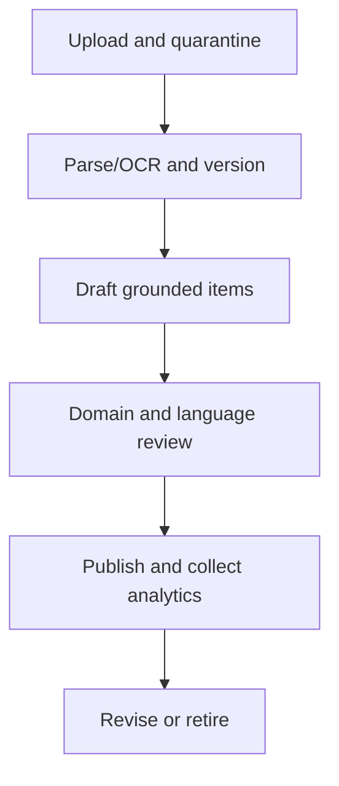
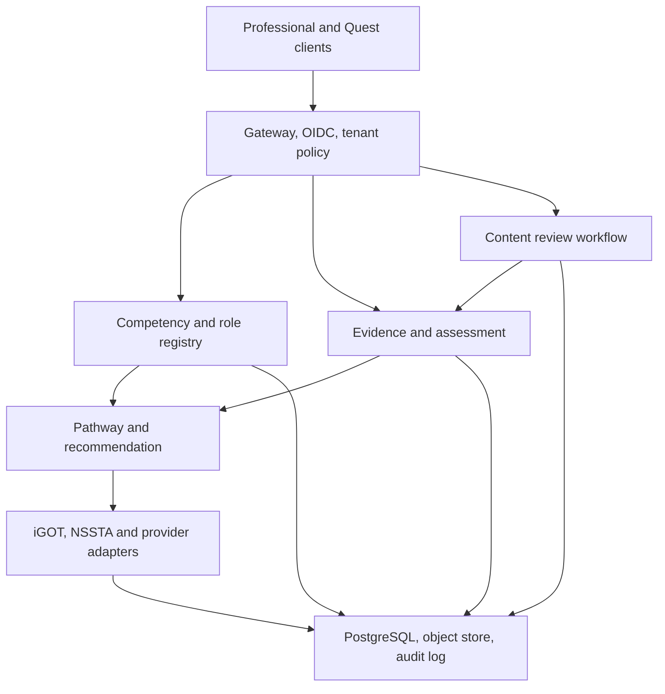
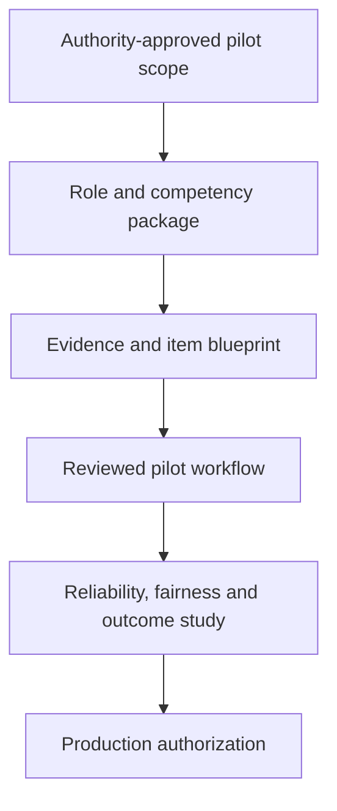

# SkillQuest SIH26101: Ground-Truth Status and Orchestration Plan

**Audit date:** 27 August 2026

**Repository:** `Abhiraj-Agarwal/SkillQuest-AI-Dungeon`

**Local branch audited:** `feat/sih26101-learning-platform` at base commit `02e4ae1`
**Decision:** Green as a problem choice; yellow as a local hackathon build; red for pilot or production deployment today.

This report reconciles the current repository, both supplied attachments, the previous feasibility report, current test/build output, the public GitHub state, and primary-source research. Percentages below are weighted engineering estimates against explicit gates. They are not lines-of-code percentages.

---

## 1. Executive answer

The plan is executable, and a meaningful cross-domain vertical slice has already been built locally. The most important qualification is that the public GitHub repository does **not** contain it yet: public `main` remains the original DSA RPG, while all SIH26101 work is uncommitted in the local working tree.

| View of completion | Current estimate | What it means |
|---|---:|---|
| Local end-to-end prototype flow | **78%** | Profile → diagnostic → explainable gap/path → catalog recommendation → grounded quiz → aggregate admin view works locally. |
| Weighted SIH expected-solution coverage | **53%** | The visible workflow is substantial, but “seamless integration” and “secure/scalable” are mostly unfulfilled, and assessment is not validated. |
| Hackathon submission readiness | **72%** | The product can be demonstrated, but it still needs to be landed, deployed, visually tested, supplied with a proof pack, and rehearsed. |
| Multi-domain platform readiness | **35%** | Four domains exist, but they are static Python seed data, not a governed multi-tenant authoring platform. |
| Controlled pilot readiness | **24%** | Identity, authorization, migrations, official taxonomy ownership, review workflow, privacy controls, and live provider access are missing. |
| Production/national-scale readiness | **14%** | There is no production identity/data/security/operations foundation or validated assessment programme. |

### What is already real

- Four curricula with 34 competencies and validated prerequisite graphs.
- Role/context profile data, self-ratings, measured quest evidence, and an explainable 0–5 gap policy.
- Prerequisite-aware pathways and transparent reason text.
- Honest iGOT/NSSTA `catalog-fallback` behavior with authoritative catalog links; no fabricated enrollment or completion.
- TXT, Markdown, PDF, and DOCX upload with limits and source-grounded MCQ validation.
- Learner Academy and aggregate-only admin screens.
- Dynamic cross-domain dungeon routing.
- Current core verification: **37 backend tests pass**, `pip check` passes, Python compilation passes, lint passes, production dependency audit reports zero findings, and Next.js builds all **14 routes**.

### What is not real yet

- Public GitHub delivery of any SIH changes.
- Live iGOT/NSSTA catalog, eligibility, enrollment, progress, nomination, or completion synchronization.
- Government SSO, server-derived identity, RBAC/ABAC, tenant boundaries, or audit logs.
- Officially approved MoSPI/NSSTA/CBC role-to-competency targets.
- Psychometrically validated competency measurement.
- Human review/publish/retire states for generated questions.
- PostgreSQL migrations, object storage, background jobs, rate limits, observability, recovery, or capacity evidence.
- Production multilingual content/UI validation.
- A verified deployment, CI workflow, browser matrix, formal accessibility audit, or performance/load report.

### The most important strategic correction

Karmayogi Bharat's public GitHub organization now includes an **AI-driven CBP service** describing role mapping, course recommendation, document processing, JWT-scoped dashboards, and competency gap analysis. SkillQuest therefore cannot credibly differentiate by saying “we map competencies and recommend courses.”

The stronger product position is:

> **SkillQuest is the governed evidence, assessment, and adaptive-practice layer around competency plans: it turns role targets and demonstrable evidence into explainable proficiency estimates, creates source-grounded assessment drafts with human controls, and closes the re-assessment loop across domains.**

The public official repository is useful research evidence, not automatically a stable partner API or reusable code dependency. No root license file was discoverable during this audit, so code must not be copied without explicit rights review.

---

## 2. Ground truth: local workspace versus public GitHub

| Question | Local workspace | Public GitHub `main` |
|---|---|---|
| SIH learning branch | Present locally as `feat/sih26101-learning-platform` | No matching branch found |
| HEAD | `02e4ae1` | Same base commit |
| Implementation snapshot | 24 modified tracked files + 18 untracked implementation/prior-report files; this audit adds this report as one more untracked file | None of these changes are visible |
| Pre-audit untracked content | 18 files, about 2,766 lines including the prior report | Not present |
| Product description | Cross-domain learning-intelligence prototype | Original DSA-only AI dungeon |
| Reproducibility for another developer | Possible only from this workspace | Impossible from public repository today |

This is the immediate operational risk. A healthy uncommitted workspace is still a single point of failure. The first action is to review and commit the work on the existing branch, then open a PR when the owner authorizes remote writes.

No commit, push, issue, or PR was created during this audit.

---

## 3. Verification record

### Core backend

| Check | Result |
|---|---|
| `backend/.venv/bin/python -m pytest -q` | **37 passed**, one pending-deprecation warning from Starlette multipart parsing |
| `pip check` | No broken requirements |
| `compileall` | Passed |

The 37 tests include 24 inherited tests and 13 additional/cross-domain learning tests. Passing tests establish regression confidence for the tested behavior; they do not establish security, assessment validity, browser compatibility, accessibility conformance, or scale.

### Frontend

| Check | Result |
|---|---|
| ESLint | Passed |
| `npm audit --omit=dev` | 0 findings |
| Next.js 15.5.24 production build | Passed; 14 routes generated |

### Optional standalone AI service

The repository's separate `services/` application is not covered by the 37 core-backend passes. It has its own dependency set. In the currently available backend environment its tests fail during collection because Google GenAI and NumPy/service dependencies are not installed there. This does **not** break the default backend path, but it means the optional-service claim needs an isolated environment and a separate CI job before it can be called verified.

### What still needs verification

- End-to-end browser flows on a deployed URL.
- Visual regression at mobile/tablet/desktop sizes.
- Keyboard-only and screen-reader walkthroughs.
- Automated axe checks plus manual WCAG/GIGW evaluation.
- API authorization tests once identity exists.
- Load, soak, concurrency, queue, and failure-recovery tests.
- Malicious file, malware/CDR, OCR, malformed PDF, and archive-bomb handling.
- Generated-item quality, ambiguity, bias, and language review.
- Real provider sandbox contract tests.

---

## 4. Attachment reconciliation: what to keep and what to discard

The supplied 1,661-line compilation contains several independent AI passes. It is valuable as a question bank and risk inventory, but it is not a source of truth.

| Attachment claim | Adjudication | Correct current reading |
|---|---|---|
| “The implementation was lost; real tested code is 0%.” | **Stale/false for this workspace** | The missing files are present; the current branch builds and its core suite passes. |
| “The backend uses PostgreSQL.” | **False** | The current application uses SQLite. PostgreSQL is a production migration target. |
| “All analyses prove iGOT has no API.” | **Too absolute** | No public partner integration contract was found. Public KB-iGOT source repositories and internal service APIs do exist. Private/partner interfaces may exist. |
| “60–70% of the architecture already existed before the pivot.” | **Overstated** | Reusable patterns existed, but profile, learning models, upload pipeline, MCQ schema, curricula, Academy, and admin flow were new work. |
| TPAC means “Training Programme Advisory Committee.” | **Incorrect in the applicable MoSPI naming** | Official MoSPI material uses **Training Programme Approval Committee**. |
| “Remove all gamification.” | **Over-correction** | Make Professional mode the MoSPI default and preserve Quest mode as an optional engagement shell. Do not couple core records to game metaphors. |
| “Use LangChain/vector RAG for every uploaded document.” | **Unnecessary as a universal rule** | The current bounded single-document flow can be grounded without a vector database. Add retrieval only when corpus size/use cases justify it. |
| “Bhashini/googletrans makes the product multilingual.” | **False/incomplete** | Translation is one dependency. Multilingual readiness also needs localized UI, source-language extraction/OCR, terminology, reviewer capacity, fonts/input, and validity testing. |
| “A source excerpt proves a question is reliable.” | **False** | It proves support/traceability, not answer-key correctness, distractor plausibility, difficulty, fairness, or competency alignment. |
| “Strategy/research is 95% complete.” | **Too high** | Desk research is mature, but institutional discovery is incomplete and the official CBP AI overlap changes positioning. |
| Invented impact, latency, relevance, user, or cost numbers | **Discard** | Measure them in a pilot or clearly label scenario estimates. |

The first 193-line attachment is best treated as the original brief and evaluator checklist. Its seven expected-solution bullets remain the primary scoring frame. Its claims that multilingual and real-time behavior are explicitly required were not independently visible in the supplied problem-statement excerpt; build them as government-readiness and scale capabilities, but do not claim they are confirmed judging criteria without checking the official SIH page.

---

## 5. Weighted SIH completion ledger

### Scoring method

Each requirement is assigned a weight and an evidence level:

| Level | Meaning |
|---:|---|
| 0 | Absent |
| 1 | Honest scaffold/fallback exists |
| 2 | Partial happy path exists |
| 3 | Demonstrable end-to-end prototype exists |
| 4 | Pilot evidence exists: authorized, governed, tested with stakeholders |

The score is `weight × level ÷ 4`. A level 3 is not production readiness.

| Expected capability | Weight | Level | Weighted score | Evidence now | Remaining proof |
|---|---:|---:|---:|---|---|
| Automated competency profile | 12 | 3 | 9.0 | Role, department, assignment, education, experience, training, goal, language, domains | Authoritative import, provenance, consent/correction, confidence, versioning |
| AI/diagnostic competency assessment | 12 | 2 | 6.0 | Self-rating plus quest evidence; explicit 65/35 policy | Blueprint, calibrated items, multiple evidence types, reliability/fairness, appeal |
| Skill-gap analysis/pathway | 12 | 3 | 9.0 | Explainable gaps, caps, prerequisites, priority, pathway | Official role targets, policy validation, confidence/expiry, change impact |
| Seamless iGOT + NSSTA integration | 18 | 1 | 4.5 | Adapter/status boundary and catalog links | Approved schemas, credentials, IDs, eligibility, enrollment/nomination, sync/webhooks |
| Personalized recommendations | 10 | 2 | 5.0 | Rule-based relevance over demo records | Verified course mappings, constraints, availability, feedback loop, evaluation |
| MCQ/quiz generation from upload | 15 | 3 | 11.25 | Four formats, bounded extraction, strict schema, exact source excerpt, fallback | Quarantine/scan/OCR, review states, item analytics, multilingual validity |
| Learner/admin dashboards | 10 | 2 | 5.0 | Academy and aggregate activity/top-gap view | History, cohorts/filters, trend/heatmap, export, small-cell policy, RBAC |
| Secure/scalable web application | 11 | 1 | 2.75 | Validation, upload bounds, a few a11y improvements, clean production dependencies | Identity, tenants, migrations, Postgres, storage, jobs, limits, monitoring, audits |
| **Total** | **100** |  | **52.5 ≈ 53%** |  |  |

### Why visible demo readiness is higher than requirement completion

A hackathon demo can use synthetic personas, catalog fallbacks, and a deterministic model policy if the boundaries are explicit. The official requirement uses stronger words—especially “seamless integration” and “secure, scalable”—that cannot be fulfilled by a labeled mock. That is why the demo can look roughly three-quarters ready while weighted fulfillment is only about half.

---

## 6. Current implementation inventory

### 6.1 Competency and domain layer

Done:

- Four curriculum slugs: DSA Fundamentals, Official Statistics, Public Policy, Digital & AI Literacy.
- 34 globally unique competency IDs.
- Prerequisite validation for missing references and cycles.
- 1–5 target levels and experience caps.
- Cross-domain dungeon seeding and namespaced boss identifiers.

Limit:

`backend/services/curricula.py` is a centralized, validated Python dictionary. That is much better than five inconsistent DSA maps, but it is **not** a database-backed domain registry. Adding Medicine, Law, Finance, Mechanical Engineering, or a departmental role still requires code review and deployment.

### 6.2 Profile and evidence

Done:

- Learner profile table and API.
- Job/department/assignment/education/experience/previous training/language/goal/domain fields.
- Assessment persistence.
- Measured game performance is converted to the 0–5 scale.

Limit:

- The client chooses a `player_id`; the server does not derive it from an authenticated subject.
- There is no field-level source/provenance, verification, consent purpose, confidence, expiry, or correction workflow.
- There are only two evidence types in the policy: self-rating and game performance.

### 6.3 Gap and pathway engine

Done:

- Deterministic 65% measured/35% self-assessment blend when both exist.
- Explicit evidence text and missing-evidence behavior.
- Experience-capped target level.
- Gap tiers and prerequisite-first pathway.

Limit:

- The weights and thresholds are transparent prototype policy, not a validated measurement model.
- Role targets come from curriculum seed data rather than an approved role map.
- The pathway considers prerequisites and gap magnitude, not time, workload, modality, accessibility, course availability, manager approval, or learner preference.

### 6.4 Recommendations and provider boundary

Done:

- Provider-tagged demo catalog entries.
- Reasoned relevance score.
- Links to official catalog owners.
- `catalog-fallback` status explicitly prevents fake sync claims.

Limit:

- The entries are not exact verified iGOT course records or live TPAC programme records.
- There is no provider identity linkage, eligibility, capacity, nomination, enrollment, completion, retry, webhook, reconciliation, or consent state.

### 6.5 Content ingestion and quiz generation

Done:

- TXT/MD/PDF/DOCX parsing.
- 5 MB bound, PDF page/text bounds, DOCX extracted-size guard.
- Exact four unique choices, valid answer index, exact contiguous source excerpt.
- Invalid model output is rejected.
- Deterministic fallback makes the feature demonstrable without a model key.

Limit:

- No OCR for scanned pages.
- No malware scan, content disarm/reconstruction, object quarantine, DLP, or file retention policy.
- No source chunk/page coordinates or stable document version hash in the visible citation.
- No draft/review/approve/publish/retire states.
- No item blueprint, duplicate detection, answerability check, bias/accessibility rubric, or empirical item statistics.
- The deterministic fallback is resilient, but its distractors are not evidence of good assessment quality.

### 6.6 Learner and administrator UX

Done:

- Academy form, curricula, self-diagnostic, pathway, course cards, upload, and quiz preview.
- Aggregate admin counts, top gaps, provider status, and privacy notice.
- Skip link, focus improvements, reduced-motion behavior, error/not-found screens, dialog semantics.

Limit:

- The visual language is still an RPG/pixel-art product. That is attractive for an optional engagement mode but too game-forward as the default MoSPI administrative experience.
- No learner history, plan calendar, evidence portfolio, credentials, reviewer workspace, cohort filters, heatmap, trend, exports, drill-down rules, or suppression.
- No formal browser/accessibility validation has been performed.

### 6.7 Platform and operations

Done:

- FastAPI + SQLAlchemy + SQLite and Next.js.
- Local seeding and bounded request validation.
- Current dependencies build cleanly.

Limit:

- Username-only identity, no password/session verification.
- SQLite and ad hoc `ensure_columns()` instead of real migrations.
- No tenant model.
- No CI workflow in the repository.
- No container/deployment manifest, object store, queue, cache, WAF, structured telemetry, SLOs, alerts, backups, or disaster-recovery exercise.

---

## 7. Product strategy for beginners through experts and many fields

### 7.1 Use one core, two experience modes

Do not delete the existing game. Decouple it.

| Layer | Professional mode | Quest mode |
|---|---|---|
| Default audience | Officials, experts, managers, reviewers | Students, beginners, voluntary practice |
| Visual language | Calm, institutional, data-first | RPG progression, sprites, combat, rewards |
| Same underlying objects | Competencies, evidence, pathway, material, items, attempts | The same objects rendered as quests/rooms/bosses |
| Governance | Full review, audit, privacy, formal language | Inherits the same controls; no separate truth store |
| Default for SIH26101 | **Yes** | Optional toggle/showcase |

Gamification should motivate; it must never redefine official proficiency, hide uncertainty, or turn government personnel data into a public leaderboard.

### 7.2 Replace static curricula with governed domain packages

Every domain should be installable as a versioned package:

| Package component | Required content |
|---|---|
| Identity | Domain ID, tenant, version, status, owner, reviewers, effective dates |
| Competency registry | Stable IDs, labels, descriptions, level descriptors, tags |
| Role maps | Role/assignment → target competencies and required levels |
| Dependency graph | Prerequisites with cycle validation and change-impact preview |
| Evidence schema | Allowed evidence types, scoring rubrics, expiry, confidence |
| Assessment blueprint | Outcome coverage, item types, difficulty, language, review rules |
| Learning mappings | Provider/course/outcome mappings with provenance and last verification |
| Localization | UI terminology, translated descriptors, reviewer status per language |
| Governance | Draft/review/approve/publish/deprecate/rollback history |

This permits Official Statistics, Medicine, Law, Finance, Agriculture, Civil Engineering, design, or vocational fields without changing the platform code. Domain experts author/review packages; engineers maintain the engine.

### 7.3 Use a continuous proficiency model carefully

The current 0–5 score is understandable and suitable for a prototype. A serious beginner-to-expert system needs:

- behavioral anchors for each level in each competency;
- calibrated item difficulty and discrimination;
- multiple evidence types rather than quiz scores alone;
- uncertainty/confidence and evidence age;
- reassessment and appeals;
- validation by domain, level, language, and relevant user groups.

IRT, Elo-like updates, or Bayesian Knowledge Tracing are possible later. Do not implement an opaque advanced model until a reviewed item bank, sufficient response data, and a decision use-case exist.

### 7.4 Make uploaded material a governed onboarding workflow

The universal multi-domain loop should be:

Generation once per approved document and reuse of a reviewed question bank will usually be cheaper and safer than regenerating questions for every learner.

### 7.5 Competitor and ecosystem position

| Platform/direction | Demonstrated strength | Do not compete on | SkillQuest's defensible contribution |
|---|---|---|---|
| [iGOT Karmayogi](https://igotkarmayogi.gov.in/) | Government learning ecosystem and course delivery | Becoming another generic catalog/LMS | Evidence, assessment, grounded-content, and reassessment layer that interoperates |
| [KB-iGOT CBP AI service](https://github.com/KB-iGOT/cbp-ai-service) | Public code describes role maps, AI course recommendations, document processing, JWT dashboards, and gap analysis | “First AI competency plan/recommender” | Governed multi-evidence proficiency, item lifecycle, adaptive practice, validation |
| [Degreed](https://degreed.com/experience/) | Enterprise skills and learning experience | Generic enterprise skill discovery | Public-sector role/evidence governance and Indian government interoperability |
| [Coursera for Government](https://www.coursera.org/government) | Large catalog, programmes, skill analytics | Breadth of external content | Provider-neutral mapping to official role outcomes and reviewed applied evidence |
| [Moodle](https://docs.moodle.org/) | Mature course/LMS workflows and extensibility | Rebuilding commodity course administration | Domain-package registry, explainable evidence loop, provider adapters |

The platform should be integration-friendly: if an existing official service already owns role plans or course records, consume those authoritative objects and contribute assessment/evidence outcomes through an approved contract. Avoid creating a second source of truth.

---

## 8. Target architecture

Use a modular monolith first. The current team does not need a fleet of microservices to prove scale. Clear modules, durable jobs, migration discipline, and observability matter more.

### Recommended technical progression

1. Keep Next.js and FastAPI.
2. Add OIDC/SAML through the authority-approved identity provider; derive subject/tenant/roles server-side.
3. Add Alembic and migrate learning state to PostgreSQL.
4. Add an object store for uploaded materials and generated artifacts.
5. Add a background worker/queue for scanning, parsing, generation, and provider synchronization.
6. Add Redis only for justified caching/rate coordination—not as an automatic checkbox.
7. Add structured logs, traces, metrics, audit events, health/readiness, SLOs, and alerts.
8. Containerize and deploy through repeatable CI/CD with environment separation.
9. Split services only when scaling/security/team ownership evidence requires it.

### Integration state machine

Each provider operation should persist a state, not a boolean:

`draft → validated → submitted → provider-accepted | provider-rejected → reconciled`

Include idempotency key, provider record ID, schema version, actor, consent/legal basis reference where applicable, timestamps, attempts, last error, and next retry. A local link click is never an enrollment.

---

## 9. Orchestration model: six parallel lanes

| Lane | Primary objective | Outputs | Depends on |
|---|---|---|---|
| A. Product/domain | Own the MoSPI story and governed competency slice | Persona, role map, descriptors, sample material, item rubric | Authority/domain reviewer |
| B. Trust/platform | Identity, tenants, data, privacy, audit | OIDC/RBAC, migrations, tenant model, data inventory, audit events | Identity/data decisions |
| C. Assessment/content | Valid evidence and controlled item lifecycle | Blueprint, review queue, quality metrics, publish/retire | Lane A descriptors |
| D. Integration | Realistic provider boundary | Contract, mock server, sandbox client, reconciliation | Provider access/schema |
| E. Experience | Professional default and optional Quest shell | Learner, reviewer, admin journeys; a11y/i18n | Shared APIs and policy |
| F. Quality/operations | Reproducibility and release evidence | CI/CD, deployment, security tests, observability, load/a11y reports | All lanes incrementally |

### Critical path

Provider contracting and identity onboarding run in parallel but can independently block the pilot. UI polish is not on the production critical path unless it prevents accessibility or user-task completion.

---

## 10. Prioritized backlog

Effort is person-days for a team already familiar with the repository. External waiting time is excluded.

### P0 — Preserve and make the current prototype reproducible

| ID | Item | Effort | Dependency | Definition of done |
|---|---|---:|---|---|
| P0-01 | Review and commit the local branch in coherent commits | 0.5–1 | Owner approval to commit/push | Clean status; diff reviewed; no secrets/DB/build artifacts; base documented |
| P0-02 | Add CI matrices | 1–2 | P0-01 | Core backend, optional service, lint, build, audits run separately on PR |
| P0-03 | Isolate optional AI-service environment | 0.5–1 | None | Lockfile/requirements install; its tests collect and pass/skip intentionally |
| P0-04 | Deploy an honest demo environment | 1–2 | CI, hosting choice | Public URL, seeded synthetic persona, health check, rollback procedure |
| P0-05 | Add automated API smoke/E2E tests | 1–2 | Deployment | Profile → assessment → quiz → admin scenario passes on every release |
| P0-06 | Complete browser/a11y visual pass | 1–2 | Deployment | Mobile/desktop, keyboard, focus, contrast, error/loading; issues recorded |

### P1 — Make the SIH submission credible and differentiated

| ID | Item | Effort | Dependency | Definition of done |
|---|---|---:|---|---|
| P1-01 | Add Professional mode and mode-neutral vocabulary | 2–4 | Design decision | MoSPI demo defaults to professional dashboard; Quest mode remains optional |
| P1-02 | Build question lifecycle: draft/review/publish/reject/retire | 4–7 | Reviewer role stub | Unreviewed items cannot be served as approved assessments; reasons/audit shown |
| P1-03 | Curate one authoritative official-statistics slice | 3–6 + reviewer | Domain owner | Source, role, descriptors, targets, items, and reviewer names/dates documented |
| P1-04 | Define provider contract and mock server | 2–4 | Provider discovery | Catalog/search/enroll/progress errors and idempotency demonstrated; mock labeled |
| P1-05 | Map exact public NSSTA/TPAC entries | 1–3 | Source review | Stable source URLs, dates, eligibility/provenance, staleness checks |
| P1-06 | Add assessment quality proof pack | 3–5 | Reviewed items/test users | Ambiguity, grounding, answer key, difficulty, acceptance and failure examples |
| P1-07 | Produce demo/deck/Q&A pack | 2–3 | All P1 slices | 4-minute flow, architecture, boundaries, metrics plan, failure-mode rehearsal |

### P2 — Controlled pilot foundation

| ID | Item | Effort | Dependency | Definition of done |
|---|---|---:|---|---|
| P2-01 | OIDC/SAML, server-derived subjects, role policy | 8–15 | Approved IdP | Learner cannot access another record; learner denied admin/reviewer; MFA policy |
| P2-02 | Tenant and organizational boundaries | 8–15 | Tenant model | Queries scoped by tenant; delegated admin tests; cross-tenant tests pass |
| P2-03 | PostgreSQL + Alembic + normalized registry/evidence schema | 10–18 | Schema review | Fresh install, upgrade, rollback, backup/restore pass; no global ID workaround |
| P2-04 | Object quarantine, scan/CDR, OCR, retention/deletion | 10–20 | Storage/security choice | Malicious/low-confidence files blocked or routed to review; lifecycle audited |
| P2-05 | Background jobs and idempotent provider sync | 8–15 | P1-04 contract | Retries/backoff/DLQ/replay/reconciliation tests pass |
| P2-06 | Audit, observability, rate limits, secrets | 8–15 | Platform foundation | Traceable decisions; SLO dashboard/alerts; key rotation; abuse tests |
| P2-07 | Privacy and GIGW control implementation | 10–20 + authority | Data inventory | Notices, purpose/retention, correction/deletion, policies and conformity evidence |
| P2-08 | Reviewer/content-owner/admin workspaces | 10–18 | Roles + workflow | Segregation of duties, queues, search/filter, history and approvals work |

### P3 — Validated learning intelligence and broad-domain scale

| ID | Item | Effort | Dependency | Definition of done |
|---|---|---:|---|---|
| P3-01 | Versioned domain-package registry and authoring UI | 15–30 | P2 data model | Import/export, cycle check, impact preview, approval, rollback |
| P3-02 | Evidence portfolio and reassessment/appeal | 12–22 | Identity + evidence model | Source, confidence, expiry, reviewer, appeal decision and audit visible |
| P3-03 | Assessment calibration pilot | 20–40 + sample | Reviewed bank and participants | Reliability/fairness/difficulty report; thresholds versioned and approved |
| P3-04 | Adaptive model beyond fixed 65/35 | 10–25 after P3-03 | Sufficient data | Offline comparison beats transparent baseline without fairness regression |
| P3-05 | Full multilingual pipeline | 20–40 per priority set | Language reviewers | UI/source/generation/review/assessment tested; glossary and fallback defined |
| P3-06 | Learning-plan constraints and outcome loop | 12–22 | Provider data | Availability, workload, preference, completion, reassessment and usefulness signals |
| P3-07 | Domain launch factory | 8–20 per domain + experts | P3-01 | Package passes governance, content, language, a11y and validation launch gate |

---

## 11. Timeline and effort envelope

These are planning ranges, not promises. External identity/provider/authority approvals can dominate calendar time.

| Milestone | Team effort | Calendar with 5–7 people | Exit result |
|---|---:|---:|---|
| Preserve verified work | 2–5 person-days | 1 day | Branch/CI/reproducible baseline |
| Submission-ready SIH demo | 15–30 person-days | 3–7 focused days | Deployed professional flow, review slice, proof pack |
| Technical pilot foundation | 70–130 person-days | 6–10 weeks | Secure tenant, durable data, controlled content, observable system |
| Governed outcome pilot | 60–120 person-days + participants | Additional 8–12 weeks | Validity/fairness/outcome evidence and refined policies |
| Production readiness | 140–260 person-days total after demo | Roughly 5–9 months | Audited, supported, recoverable, authorized deployment |
| Each new serious domain | 8–20 platform/content person-days + expert review | 2–6 weeks/domain | Governed package, reviewed bank, pilot users |

### Next 36 hours, given the current state

Run work in parallel; do not have six people editing the same files.

| Hours | Lane A/C | Lane B/F | Lane D | Lane E | Product/demo lead |
|---|---|---|---|---|---|
| 0–3 | Freeze pilot persona and sources | Review diff; commit plan; CI skeleton | Contract operations and mock states | Professional-mode wireframe | Freeze claim ledger and judging rubric |
| 3–8 | Review one competency slice/items | Core + optional-service CI | Mock catalog/enrollment/progress failures | Implement professional shell | Draft demo and architecture |
| 8–15 | Add item review rubric/state | Deploy and smoke tests | Map TPAC records with provenance | Reviewer/admin screens | Draft Q&A and evidence table |
| 15–22 | Create clean/messy test corpus | File/security and API edge tests | Integration status/reconciliation UI | Mobile/a11y fixes | Deck and impact measurement plan |
| 22–28 | Review generated outputs | Load baseline and observability | Failure rehearsal | Visual polish | Assemble proof pack/video backup |
| 28–33 | Final content sign-off | Release-candidate gate | Contract narrative sign-off | Full E2E run | Three timed rehearsals |
| 33–36 | No new features | Fix only release blockers | Fix only release blockers | Fix only release blockers | Record backup demo and freeze |

---

## 12. Suggested six-person ownership map

| Role | Accountable for | Must not work alone on |
|---|---|---|
| Product/domain lead | Scope, MoSPI persona, role map, judge story, stakeholder questions | Competency targets without domain reviewer |
| Backend/platform engineer | Identity, data model, migrations, policy enforcement | Security acceptance without QA/security review |
| Frontend/UX engineer | Professional/Quest shells, learner/reviewer/admin journeys | Accessibility sign-off without users/evaluator |
| AI/assessment engineer | Generation, validators, evidence model, analytics | Item publication without domain review |
| Integration/data engineer | iGOT/NSSTA adapters, mock server, reconciliation, catalog provenance | Claims of provider success without contract response |
| QA/DevOps/research lead | CI/CD, E2E, load/a11y/security checks, claim/source ledger, demo evidence | Final product decisions without product lead |

The team lead should manage dependencies and acceptance gates, not become the sole presenter and merge bottleneck.

---

## 13. Acceptance gates

### Gate G0 — Reproducible baseline

- All intended files are committed on a real branch.
- Core and optional-service jobs are separately green or intentionally skipped with reason.
- No secrets, generated DB, `.next`, virtualenv, or uploaded learner content is committed.
- A new developer can follow the README successfully.

### Gate G1 — Submission-ready demo

- Deployed Professional-mode flow works with a seeded synthetic MoSPI persona.
- Quest mode is optional and shares the same competency/evidence records.
- Provider fallback is visibly labeled; failure states work.
- One reviewed material generates traceable draft items.
- No screen or spoken claim implies production security, official approval, or live enrollment.
- Backup video and screenshots exist.

### Gate G2 — Controlled pilot

- Approved identity and authorization on every protected route.
- Tenant isolation and cross-user/cross-role negative tests pass.
- One authority-approved role/competency package is versioned.
- Unreviewed items cannot reach pilot assessments.
- Data inventory, retention, correction/deletion, threat model, incident route, audit records exist.
- Provider sandbox contract tests pass or integration remains explicitly out of pilot scope.

### Gate G3 — Production authorization

- Assessment validity/fairness report accepted for its intended use.
- External security audit and government hosting/conformity requirements close critical findings.
- SLOs, capacity, backup/restore, disaster recovery, incident response, support ownership pass exercises.
- Privacy/legal/records owners approve processing and retention.
- Provider agreements and operational reconciliation are active.

### Gate G4 — New domain launch

- Named domain owner and reviewers.
- Versioned role maps and behavioral proficiency descriptors.
- Reviewed learning mappings and item blueprint.
- Language/accessibility coverage for the audience.
- Pilot result and rollback/retirement plan.

---

## 14. Metrics that prove value

Do not use XP, clicks, or generated-question count as the main outcome.

| Dimension | Prototype metric | Pilot/production metric |
|---|---|---|
| Profile | completion rate, missing evidence rate | verified field coverage, correction rate, freshness |
| Assessment | completion, source-support pass | reliability, difficulty/discrimination, bias/fairness, appeal overturns |
| Recommendation | click/accept and reason shown | usefulness, enrollment, completion, post-learning gap change |
| Learning | re-assessment delta | retention, job-relevant transfer, supervisor/domain evidence where appropriate |
| Content | validator pass/reject | reviewer acceptance, ambiguity, source quality, retirement, defect escape |
| Integration | fallback/configured/error state | sync success, latency, reconciliation backlog, duplicate prevention |
| Platform | error and task completion | SLOs, p95 latency, availability, queue age, recovery time, cost per active learner |
| Equity/access | keyboard/mobile smoke | language-group performance, accessibility findings, assisted completion |

Before claiming impact, define a baseline and a comparison. “Users liked it” and “the LLM produced questions” are not evidence of competency improvement.

---

## 15. Risk register

| Risk | Probability | Impact | Mitigation | Owner |
|---|---|---|---|---|
| Local work is lost/unreviewable | High until committed | Critical | P0-01 immediately; coherent commits and PR | Tech lead |
| Live iGOT/NSSTA access unavailable | High | Critical to full PS | Honest adapter, mock contract, authority request, scope gate | Integration lead |
| Product duplicates official CBP AI work | Medium-high | High | Reposition around governed evidence/assessment/re-assessment; interoperability | Product lead |
| Username/player-ID access leaks data | Certain in current design | Critical | Never pilot; OIDC + server subject + authorization tests | Platform lead |
| Gap score is mistaken for certification | High | High | Call it diagnostic evidence estimate; confidence, human policy, validation | Assessment lead |
| Generated items are plausible but invalid | High | High | Review workflow, blueprint, analytics, retire defects | Content lead |
| Static Python curricula block scale | High | High | Versioned registry/package authoring after secure data model | Platform/domain |
| Game UX reduces institutional trust | Medium | High | Professional default; optional Quest shell | UX lead |
| Multilingual output is unreviewed | High | High | Priority languages, glossary, language reviewers, parity tests | Language/content |
| File upload becomes an attack/data leak path | Medium-high | Critical | Quarantine, scan/CDR, OCR confidence, DLP, retention/deletion | Security/platform |
| Optional service drifts from default backend | Medium | Medium | Separate contract tests/CI or retire/consolidate it | AI/platform |
| Scale is claimed without measurements | High | High | Load model, capacity test, SLO/cost evidence | QA/DevOps |

---

## 16. Stakeholder and integration discovery checklist

Ask Karmayogi Bharat/iGOT:

1. Is there a supported partner/sandbox contract for catalog search, competency mappings, enrollment, progress, completion, and webhooks?
2. What identity federation, service-account, scopes, consent/legal basis, rate limits, and audit requirements apply?
3. Which records are authoritative, what are stable identifiers, and how are schema versions/deprecations communicated?
4. Does the public CBP AI service represent an active product direction, reference implementation, pilot, or research code?
5. What integration or contribution model is preferred, and what licenses/terms apply?

Ask MoSPI/NSSTA/TPAC owners:

1. Which one role and assignment should define the first pilot?
2. Who owns the competency targets and level descriptors?
3. Which training-calendar/programme metadata, eligibility, nomination, capacity, attendance, and completion signals are available?
4. Which materials may be used for item generation and which are restricted?
5. What reviewer roles, approval records, and retention are required?
6. What decision, if any, may the diagnostic influence? It should not silently become a high-stakes personnel decision.

Ask identity/security/privacy owners:

1. Approved IdP and attributes; MFA/session policy.
2. Hosting/data-residency/network requirements.
3. Data classification, purpose, retention, correction/deletion/grievance process.
4. Security audit, safe-to-host, logging/incident, and records-management requirements.
5. Minimum cohort size and export restrictions for aggregate dashboards.

---

## 17. Judge-ready narrative

### Four-minute demo

1. **Problem:** an official's role, evidence, available learning, and reassessment are disconnected.
2. **Profile:** load a clearly synthetic official-statistics persona.
3. **Diagnostic:** show self-rating plus quest/assessment evidence and explain the 65/35 prototype policy.
4. **Gap/path:** show target, observed evidence, gap, prerequisite order, and reason.
5. **Recommendation:** show authoritative catalog links and the explicit fallback status; do not click a fake “enrolled” success.
6. **Content:** upload one approved public document; show a grounded draft with source excerpt and reviewer state.
7. **Admin:** show aggregate gaps and the production access warning.
8. **Architecture/ask:** show the approved integration/identity/governance steps needed for pilot.

### Tough questions and precise answers

**“Is this already doing what iGOT's CBP AI work does?”**

The public CBP service confirms that role mapping and course recommendation are active official directions. SkillQuest should integrate with that direction rather than compete with it. Its specific contribution is governed evidence capture, adaptive assessment and practice, source-grounded item workflow, explainable gap evidence, and post-learning reassessment across domain packages.

**“Where is the seamless integration?”**

It is not live. The current build is intentionally `catalog-fallback`. It defines the user and adapter boundary but does not claim enrollment/progress. Production activation requires an approved partner contract, credentials, stable IDs, schemas, rate limits, and reconciliation rules.

**“Why should we trust 65/35?”**

You should not treat it as a universal truth. It is a transparent prototype baseline that keeps demonstrated evidence above self-report. The pilot must compare policies against independently reviewed evidence, publish reliability/fairness results, and version the chosen policy.

**“Does the source excerpt eliminate hallucination?”**

No. It proves that a statement is supported by the source. It does not prove question alignment, difficulty, correct key, plausible distractors, fairness, or language quality. Generated items are drafts until reviewed and monitored.

**“Can it serve lakhs of users?”**

Not yet. The scaling design is straightforward—generate/review once per document, asynchronous jobs, cache reviewed banks, PostgreSQL/object storage, stateless APIs—but no load or recovery evidence exists today. Present the capacity test plan, not an invented number.

**“Why keep the game?”**

Engagement needs differ. Quest mode can help beginners and voluntary practice; Professional mode is the institutional default. Both use the same governed competency and evidence engine, and game rewards never become official proficiency evidence by themselves.

---

## 18. Exact next actions, in order

1. Review the existing local diff for secrets, generated artifacts, and unintended changes.
2. Commit it in coherent units on `feat/sih26101-learning-platform`; do not merge directly to `main`.
3. Add CI for core backend, optional service, frontend lint/build/audit, and a minimal E2E flow.
4. Deploy a seeded synthetic demo and complete browser/mobile/keyboard testing.
5. Make Professional mode the MoSPI default while preserving optional Quest mode.
6. Select one official-statistics role and get a named domain reviewer for its targets/descriptors.
7. Add draft/review/publish/retire states and enforce “unreviewed cannot be served.”
8. Create a provider contract/mock with honest states, then request the real sandbox/terms.
9. Build the judge proof pack: sources, tests, limitations, failure cases, measurement plan, architecture.
10. Only after the submission baseline is frozen, start OIDC/tenant/PostgreSQL/migration work for a pilot.

If time is scarce, stop after action 9 for the hackathon. Do not half-implement production identity or claim scale without evidence.

---

## 19. Primary sources and research used

Institutional and platform:

- [Mission Karmayogi factsheet — PIB](https://www.pib.gov.in/FactsheetDetails.aspx?Id=148591&lang=1&reg=3)
- [Karmayogi Competency Model — Capacity Building Commission](https://cbc.gov.in/karmayogi-competency-model-kcm)
- [iGOT Karmayogi](https://igotkarmayogi.gov.in/)
- [NSSTA documents and TPAC training calendars](https://nssta.gov.in/document)
- [Karmayogi Bharat public GitHub organization](https://github.com/KB-iGOT)
- [KB-iGOT CBP AI service](https://github.com/KB-iGOT/cbp-ai-service)
- [Bhashini](https://bhashini.gov.in/)

Government quality, privacy, accessibility, and security:

- [Digital Personal Data Protection Act, 2023 — MeitY PDF](https://www.meity.gov.in/static/uploads/2024/06/2bf1f0e9f04e6fb4f8fef35e82c42aa5.pdf)
- [Digital Personal Data Protection Rules, 2025 — MeitY PDF](https://www.meity.gov.in/static/uploads/2025/11/53450e6e5dc0bfa85ebd78686cadad39.pdf)
- [GIGW 3.0 introduction](https://guidelines.india.gov.in/introduction/)
- [GIGW 3.0 features](https://guidelines.india.gov.in/new-features-of-gigw-3-0/)
- [GIGW conformity matrix](https://guidelines.india.gov.in/annexure-ii-matrix-to-check-conformity/)
- [CERT-In security guidelines index](https://www.cert-in.org.in/s2cMainServlet?pageid=GUIDLNVIEW01)
- [CERT-In secure application guideline](https://www.cert-in.org.in/s2cMainServlet?pageid=GUIDLNVIEW02&refcode=CISG-2024-01)
- [WCAG 2.2](https://www.w3.org/TR/WCAG22/)
- [OWASP Top 10: 2025](https://owasp.org/www-project-top-ten/)

Assessment and AI quality:

- [NAACL 2024: automated distractor generation](https://aclanthology.org/2024.findings-naacl.193/)
- [EDM 2024: faithfulness of LLM-generated feedback](https://educationaldatamining.org/edm2024/proceedings/2024.EDM-short-papers.49/)

Research implications:

- LLMs can draft plausible distractors but may fail to anticipate real misconceptions; domain review and response analytics remain necessary.
- Fluent educational feedback can contain unsupported claims; grounding, validation, human controls, and measured error rates are required.

---

## Final verdict

### 🟢 Green light: continue with SIH26101

The local code proves that the repository can support a compelling, honest, cross-domain demonstration.

### 🟡 Yellow light: current build

The demo flow is real, but the implementation is not yet present on public GitHub, the default identity is unsafe, the provider integration is a fallback, and the assessment/content model is unvalidated.

### 🔴 Red light: real officials or production data today

Do not deploy the current build to real officials or use it for personnel decisions.

The single biggest next move is not another AI feature. It is to **land the verified work and turn one official-statistics pathway into a governed, reviewed, integration-ready slice with a professional default experience and honest proof at every boundary.**
