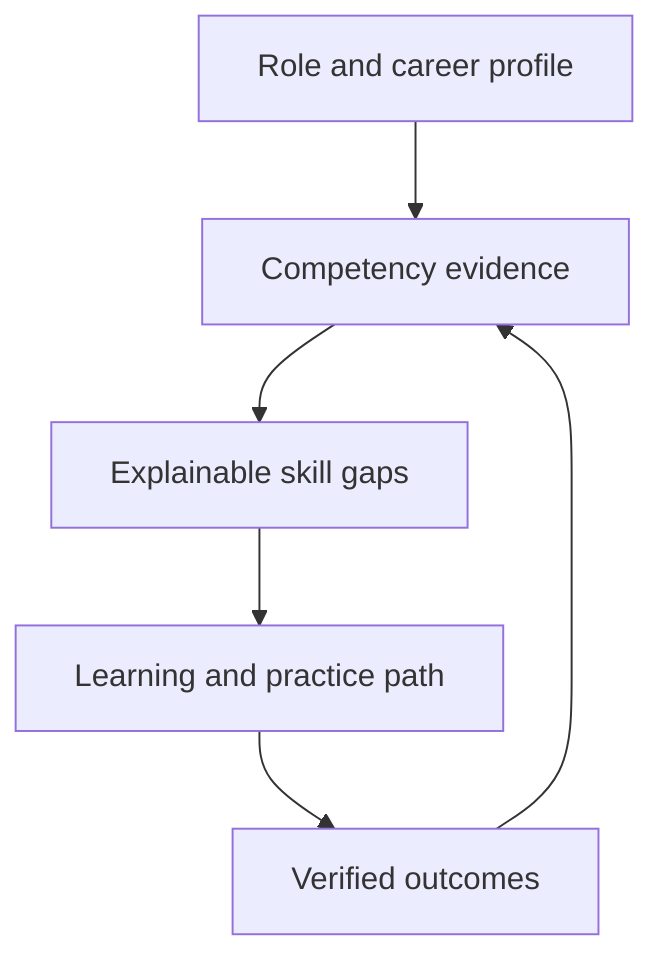
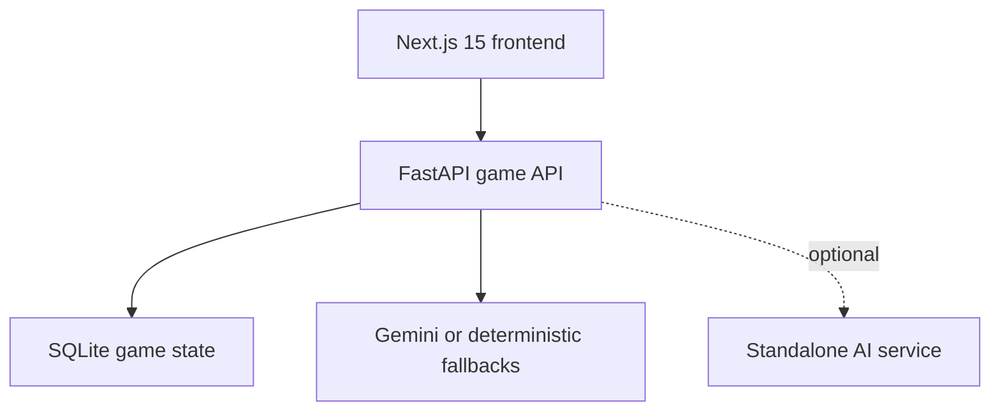
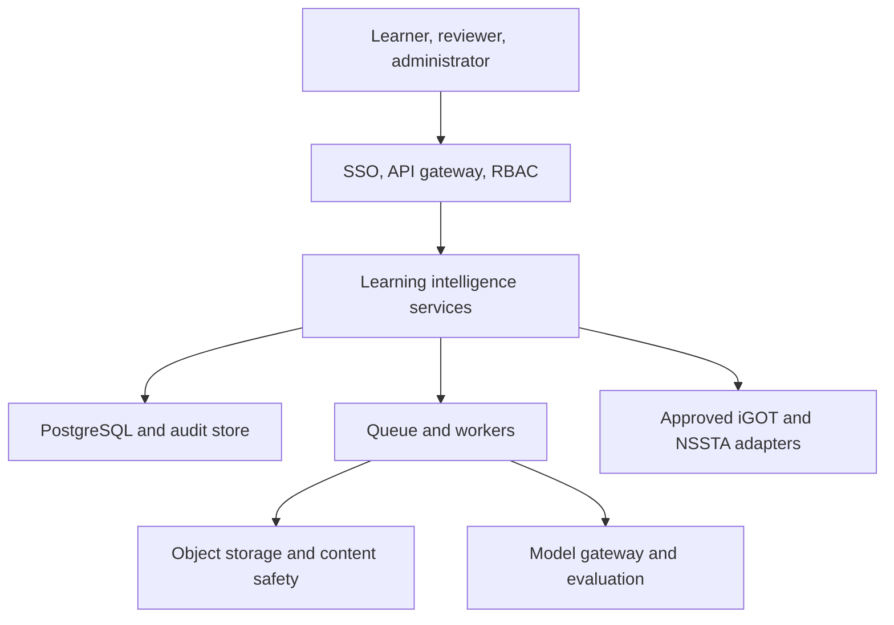

> **Archived, pre-rename document.** This audit was written against the project under its former
> working name (referred to throughout as "SkillQuest") and its GitHub source repository at the
> time. The project has since been de-branded and that name is no longer used; this document is
> kept verbatim as a historical record of the audit rather than rewritten, since editing a dated
> audit's factual description of what it examined would misrepresent it. See
> [`docs/archive/README.md`](README.md) for what changed since, and the current root
> [`README.md`](../../README.md) for the project's present state.

# SIH26101 — feasibility audit and execution roadmap (archived)

**Audit date:** 27 August 2026  
**Repository audited:** `Abhiraj-Agarwal/SkillQuest-AI-Dungeon`  
**Implementation branch:** `feat/sih26101-learning-platform`  
**Problem owner/theme:** MoSPI · Software · Smart Education

> ## Verdict
>
> **🟡 Yellow Light for the current repository as an SIH26101 submission.**
>
> The core is technically reusable and the branch now proves a cross-domain vertical slice. The single biggest remaining reason it is not green is that **production identity/RBAC and an approved iGOT/NSSTA integration contract are absent**. Those are trust and access boundaries, not UI work that should be mocked and called complete.
>
> **🟢 Green Light for SIH26101 as the problem-statement choice.** It is a strong fit for the existing adaptive engine, has a clear public-service outcome, and offers enough technical depth to stand out if integration truthfulness, explainability, and governance are demonstrated.

---

## 0. Read this first: what each status means

| Label | Meaning in this audit |
|---|---|
| ✅ Existing | Was already present and working on the repository's `main` branch. |
| 🆕 Implemented | Added on `feat/sih26101-learning-platform` and covered by automated or HTTP verification. |
| 🧪 Demo fallback | Demonstrates the interface and failure mode but is not a live government-system integration. |
| ⛔ Production blocker | Requires authorization, domain ownership, infrastructure, or governance that cannot be honestly invented inside a public repository. |

The implementation deliberately does **not** fabricate external course IDs, enrolments, completion records, or government credentials.

---

# 1. Pain points and core understanding 🔎

## 1.1 The exact problem

SIH26101 is not asking for another content library. It asks for a **closed learning-intelligence loop** for officials in India's Official Statistical System:

1. Build a competency profile from role, assignment, education, experience, and prior training.
2. assess current competency with credible evidence;
3. identify role-relevant gaps;
4. recommend a prerequisite-aware learning pathway using iGOT modules and NSSTA/TPAC programmes;
5. generate MCQs/quizzes from uploaded learning material;
6. show learner and administrator outcomes; and
7. do all of that securely and at government scale.

The real product is the decision loop below, not the individual AI features:

## 1.2 Why the problem exists

- **Role information and learning history are fragmented.** Designation alone does not reveal what an official actually does or which statistical products they support.
- **Course discovery is not the same as personalization.** A large catalog still leaves users to infer what to take, in what order, and why.
- **Self-assessment is noisy.** Novices often cannot calibrate their own level; experts may understate tacit capability. Demonstrated evidence must progressively replace self-report.
- **Capabilities evolve faster than static training plans.** Official statistics now intersects with GIS, cloud, big data, ML, responsible AI, data governance, and communication.
- **Administrators need demand signals.** Completion counts do not reveal whether high-priority competency gaps are shrinking.
- **Training material is expensive to operationalize.** Turning a policy note or module into a reviewed question bank is repetitive and requires traceability.
- **Government integrations have trust boundaries.** Identity, enrolment, progress, and personnel data require approved contracts, schemas, access controls, and auditability.

Mission Karmayogi explicitly uses the FRAC approach—roles, activities, and competencies—and iGOT is the learning delivery environment. The current CBC Karmayogi Competency Model describes behavioural and functional competencies and role-based course mapping. These make a role-to-competency model materially better aligned than generic “recommended for you” content. See the [PIB Mission Karmayogi factsheet](https://www.pib.gov.in/FactsheetDetails.aspx?Id=148591&lang=1&reg=3), [CBC Karmayogi Competency Model](https://cbc.gov.in/index.php/karmayogi-competency-model-kcm), and [iGOT Karmayogi](https://igotkarmayogi.gov.in/).

## 1.3 Primary stakeholders

| Stakeholder | Need | Risk if designed poorly |
|---|---|---|
| Statistical officials and field staff | Clear role-relevant learning with fair diagnostics | Wrong labeling, irrelevant training, learner distrust |
| New entrants and career switchers | Guided foundations and visible prerequisites | Expert-level content too early; abandonment |
| Senior specialists | Evidence-based gap checking without forced repetition | Oversimplified pathways; loss of credibility |
| Supervisors and competency owners | Cohort gaps and development planning | Surveillance-like use or individual ranking without context |
| NSSTA/TPAC and training administrators | Map needs to programmes and measure outcomes | Recommendations to unavailable/ineligible programmes |
| iGOT/Karmayogi Bharat integration owners | Safe interoperable catalog, identity, and progress exchange | Duplicate truth, broken records, unauthorized API use |
| Content authors and reviewers | Fast grounded item drafting and review | Hallucinated or ambiguous questions entering production |
| Security, legal, and data-protection teams | Purpose limitation, access control, retention, auditability | Personal-data leakage and non-compliant processing |

## 1.4 What is inefficient today

- Static training calendars cannot adapt to current role evidence.
- Course catalogs typically optimize discovery, not competency closure.
- Completion is often treated as competence even when no applied assessment exists.
- Manual MCQ creation is slow; unconstrained LLM generation is fast but unsafe.
- A single pathway is usually applied to beginners and experts, creating either overload or boredom.
- Integration is commonly demonstrated with screenshots or hard-coded links rather than a recoverable adapter and explicit sync state.

**Core framing for evaluators:** SkillQuest is an **explainable skill-intelligence and practice layer**, not a replacement for iGOT, NSSTA, HR systems, or competency owners.

---

# 2. Current codebase audit 🧭

## 2.1 Baseline architecture and health

The original repository is a coherent adaptive DSA learning RPG:

Before this upgrade:

- ✅ frontend lint passed;
- ✅ production build passed;
- ✅ 24 backend tests passed;
- ✅ the main combat loop, question generation, semantic judgment, difficulty selection, progression, guilds, leaderboard, and dashboards were implemented;
- ⚠️ identity was username-only and held in browser local storage;
- ⚠️ the curriculum, layout, routing dashboard, sprites, and terminology were coupled to 11 DSA topics;
- ⚠️ SQLite and in-process long-running AI calls limited horizontal scale;
- ⚠️ four high-severity production dependency findings existed in the initial `npm audit` baseline.

## 2.2 What was reusable

| Existing capability | Why it matters to SIH26101 |
|---|---|
| Per-topic rolling accuracy | Becomes one demonstrated-evidence source for competencies. |
| Prerequisite knowledge graph | Becomes a teachable, ordered competency pathway. |
| Adaptive difficulty | Supports novice-to-expert practice without separate applications. |
| Semantic free-text assessment | Provides applied evidence beyond completion. |
| Player progression and engagement loop | Can improve repeated practice and retention when used carefully. |
| Single browser-to-API client boundary | Makes new learning APIs easy to add without fetch calls scattered through UI. |
| FastAPI service layer and tests | Supports isolated deterministic gap-analysis and ingestion tests. |
| AI fallbacks | Provides graceful degradation for a hackathon demo and network outages. |

## 2.3 What was structurally DSA-only

- `TOPIC_GRAPH` was a static DSA constant on both backend and frontend.
- The dungeon page filtered API rooms back to that static graph.
- the dashboard and RPG labels assumed DSA topics;
- question topics used machine identifiers such as `dynamic_programming`;
- monster mappings had no cross-domain fallback;
- `accuracy_history` is unique on `(player_id, topic)`, not `(player_id, curriculum_id, competency_id)`;
- every boss used the topic `boss`, which would share boss progress across curricula;
- the README and onboarding promised only DSA.

## 2.4 Current implementation coverage

| Required capability | Main branch | Upgrade branch | What remains |
|---|---|---|---|
| Automated competency profile | Username/game stats only | 🆕 role, department, assignment, education, experience, training, goal, language, level, target domains | HRMS/iGOT import, field provenance, profile confidence, consent and correction workflow |
| AI competency assessment | DSA answer history | 🆕 explicit 0–5 self-assessment combined with quest evidence | Calibrated item banks, supervisor/portfolio evidence, psychometric validation, bias review |
| Skill-gap analysis | Weakest DSA topic | 🆕 deterministic, explainable role target vs observed evidence | Official competency-owner target matrix and versioning |
| Personalized pathway | DSA graph | 🆕 prerequisite-ordered paths for four disciplines and four experience bands | Scheduling, workload constraints, accessibility preferences, longitudinal optimization |
| iGOT recommendations | None | 🧪 authoritative catalog link plus honest adapter status | ⛔ approved endpoints, credentials, exact course mapping, eligibility, enrolment, progress/webhooks |
| NSSTA/TPAC recommendations | None | 🧪 NSSTA programme catalog link plus honest status | ⛔ TPAC/programme feed, nomination rules, seats, dates, eligibility, completion return |
| Uploaded-content quiz generation | None | 🆕 TXT/MD/PDF/DOCX, bounded extraction, grounded MCQs, deterministic fallback | OCR, malware/CDR pipeline, reviewer workflow, multilingual validation, item analytics |
| Learner dashboard | Game stats | 🆕 Academy: profile, gaps, pathway, recommendations, practice, quiz preview | Learning plan calendar, history, credentials, evidence portfolio |
| Administrator dashboard | DSA AI panel | 🆕 aggregate activity and top-gap view with explicit access warning | ⛔ SSO/RBAC, tenant/cohort filters, small-cell suppression, exports, audit log |
| Multi-domain support | DSA only | 🆕 DSA, official statistics, public policy, digital literacy | Authoring UI, taxonomy service, domain-owner review, many more fields |
| Beginner-to-expert support | Adaptive easy/medium/hard | 🆕 four profile levels cap pathway target; each competency has target level | Calibrated proficiency descriptors and expert evidence types |
| Secure scalable web app | Local CORS, validation | 🆕 upload bounds, DOCX expansion guard, aggregate-only admin payload, dependency audit clean | ⛔ real authentication/RBAC, PostgreSQL, object storage, queues, rate limits, secrets, WAF, observability |

---

# 3. Feasibility of execution ⚙️

## 3.1 Is it executable from this codebase?

**Yes, in stages.** The repository is a strong accelerator for the adaptive-practice and explainability portions. A persuasive hackathon prototype can be built and has now been implemented as a vertical slice. A production government platform cannot be completed in 36 hours because the critical blockers are external authorization and validation, not coding speed.

## 3.2 What is realistic in 36 hours

### Demonstrable MVP

- one official-statistics persona with a full role profile;
- a 0–5 competency diagnostic with visible evidence weights;
- a prerequisite-ordered path that changes when level or ratings change;
- exact links to integration-owned catalogs, with a status panel that says whether live sync is configured;
- one adaptive practice quest demonstrating evidence flowing back into the pathway;
- upload a learning note and generate source-grounded MCQs;
- learner and aggregate administrator views;
- failure-mode demo: remove the model key and show deterministic quiz fallback;
- a data-driven change made live, such as altering a prerequisite or adding a competency.

### Do not claim in the MVP

- production iGOT enrolment or progress sync without approved credentials;
- official KCM/FRAC alignment until the competency owner validates every mapping;
- psychometrically validated proficiency from a few gameplay questions;
- DPDP/GIGW compliance merely because basic security controls exist;
- multilingual support because the UI accepts a language string;
- national scale because the app runs locally.

## 3.3 Technical requirements

| Area | Hackathon requirement | Production requirement |
|---|---|---|
| Identity | Demo player/persona | Government-approved OIDC/SAML/SSO, MFA policy, service identities |
| Competency data | Reviewed seed JSON | Versioned taxonomy service, KCM/FRAC ownership, role-target matrices |
| Learning catalog | Verified public links or sandbox records | Approved iGOT catalog/enrolment/progress APIs and NSSTA/TPAC programme feed |
| Assessment | Short calibrated demo bank + evidence weights | Item bank governance, reliability/fairness studies, accommodations |
| Content ingestion | Bounded text/PDF/DOCX extraction | Object storage, malware/CDR scan, OCR, DLP, retention and deletion workflow |
| AI | Gemini plus deterministic fallback | Model gateway, data-processing terms, prompt/version registry, evaluation suite, quotas |
| Data | SQLite demo | PostgreSQL, migrations, encryption/KMS, backup/PITR, tenancy |
| Async work | Request/response | Queue/workers for ingestion, generation, notifications, and sync retries |
| Operations | Local logs | structured logs, traces, metrics, SLOs, alerts, audit trail |
| Accessibility | Keyboard/focus/reduced-motion baseline | WCAG 2.2 AA and GIGW 3.0 audit with assistive-technology testing |

## 3.4 Main blockers

1. **iGOT/NSSTA contract and sandbox.** Public Sunbird documentation can guide an adapter, but it does not authorize production iGOT operations. KB-iGOT publishes Sunbird-based repositories, and Sunbird exposes competency framework and search patterns; use those to design, not to assert access. See [KB-iGOT on GitHub](https://github.com/KB-iGOT), [Sunbird competency framework](https://project-sunbird.github.io/architecture/usecase/), and [Sunbird asset search APIs](https://knowlg.sunbird.org/learn/product-and-developer-guide/assets-search-service/apis).
2. **Official competency mapping.** The demonstration taxonomy must be reviewed and versioned by MoSPI/NSSTA/CBC owners.
3. **Identity and authorization.** Username-only identity makes every player-ID route insecure for real use.
4. **Assessment validity.** A game score is evidence, not an automatically valid certification decision.
5. **Content rights and privacy.** Uploaded materials may be confidential, copyrighted, malicious, scanned, or multilingual.
6. **Scale architecture.** SQLite and synchronous generation are appropriate for a prototype, not a national deployment.
7. **Multilingual depth.** Translation requires interface localization, content review, model evaluation, fonts/input, and language-specific assessment quality.

## 3.5 Target architecture

The integration layer should use provider-specific adapters behind an internal contract such as `search_courses`, `get_eligibility`, `request_enrolment`, `get_progress`, and `sync_completion`. Every operation needs `configured`, `pending`, `succeeded`, `failed`, and `reconciliation_required` states plus idempotency keys.

---

# 4. Impact and relevance 🌍

## 4.1 Who benefits

- **Officials:** less search effort, clearer next action, practice at the right level.
- **Departments:** evidence about capability demand, not only content consumption.
- **NSSTA/TPAC and iGOT owners:** better targeting and feedback on course-to-competency coverage.
- **Citizens and policy teams:** indirect benefit from stronger statistical quality, communication, and responsible technology use.
- **Content teams:** faster item drafting with traceable source support and human review.

## 4.2 Credible impact chain

Do not claim that the application directly improves national statistics. Use an evidence chain:

`better gap signal → more relevant training → applied practice → verified competency gain → improved work quality`

Each arrow must be measured. Recommended KPIs:

| Layer | KPI | Guardrail |
|---|---|---|
| Access | activation rate, time to first path | completion by language/accessibility cohort |
| Relevance | recommendation acceptance, “useful for role” rating | reason codes and opt-out rate |
| Learning | pre/post applied assessment delta | item exposure and confidence interval |
| Efficiency | time to validated proficiency, redundant modules avoided | do not reward speed at the expense of mastery |
| Transfer | supervisor-validated work sample or portfolio evidence | no automated employment consequence |
| Content | reviewer acceptance, ambiguity rate, source-support pass rate | zero unreviewed high-stakes items |
| Equity | outcome difference across cohorts | minimum sample sizes and privacy suppression |
| Integration | sync success, reconciliation backlog, stale catalog age | never hide failed or pending state |

## 4.3 Scale beyond the hackathon

The model generalizes beyond CSE because a curriculum is now data, not UI logic. A domain package needs:

- globally stable competency IDs and version;
- proficiency descriptors for levels 0–5;
- role targets and optional experience caps;
- prerequisites;
- validated evidence types and item banks;
- course/programme mappings with provenance;
- a domain owner and review date.

This can support economics, survey operations, health statistics, agriculture, finance, GIS, public policy, cybersecurity, management, and technical fields without cloning the application. The correct scaling unit is a **governed competency package**, not a new hard-coded dungeon.

---

# 5. Innovation and existing solutions 💡

## 5.1 Competitor landscape

The limitations below are product-positioning inferences from public product material, not claims about private implementation.

| Solution | Public strength | Opportunity for SkillQuest |
|---|---|---|
| [iGOT Karmayogi](https://igotkarmayogi.gov.in/) | Government learning ecosystem and competency-oriented mission context | Add an explainable diagnostic/practice layer while leaving catalog and completion truth with iGOT. |
| [Degreed](https://degreed.com/experience/) / [Maestro](https://degreed.com/experience/blog/degreed-maestro-skill-assessment-personalized-learning/) | Enterprise learning experience, skills, pathways, AI-assisted assessment | Differentiate through Official Statistical System workflows, government interoperability, grounded item review, and transparent evidence weights. |
| [Cornerstone Skills Graph](https://www.cornerstoneondemand.com/resources/article/what-is-the-cornerstone-skills-graph/) | Large enterprise skills intelligence and content mapping | Offer a smaller auditable public-sector competency graph where every target and prerequisite has an owner and version. |
| [Coursera for Government](https://www.coursera.org/government) / [Skills Dashboard](https://www.coursera.org/government/skillsdashboard) | Broad catalog, government programmes, skill analytics | Map external learning to MoSPI/NSSTA role outcomes and add applied SkillQuest evidence. |
| [Moodle competencies](https://docs.moodle.org/) | Open learning platform with competency frameworks and plans | Preserve openness but add adaptive evidence, source-grounded assessment generation, and government adapters. |

## 5.2 Technical differentiation that is defensible

1. **Hybrid evidence, not AI mystique.** Demonstrated performance is weighted above self-report, and the evidence string is shown.
2. **Prerequisite-aware, role-capped pathways.** Beginner targets do not force expert depth immediately; experts are not sent through every foundation by default.
3. **Grounded MCQ generation.** Every accepted item has exactly four unique options, a valid answer index, and an exact source excerpt. Invalid model output is rejected and replaced with a deterministic extractive fallback.
4. **Honest integration state.** The app distinguishes configured integration from catalog fallback.
5. **Data-driven live change.** A competency, prerequisite, target, or entire field can be added without rewriting the map or gap algorithm.
6. **Learning evidence inside an engaging practice loop.** Gamification is the delivery layer; the skill record remains explicit and interpretable.

Research supports caution rather than automatic trust. Current work on MCQ and distractor generation shows the importance of quality control, and research on feedback faithfulness and hallucination shows why citations and human review are necessary. Useful starting points include the [ACM study on LLM MCQ generation](https://dl.acm.org/doi/10.1145/3657604.3664714), [NAACL distractor generation findings](https://aclanthology.org/2024.findings-naacl.193/), [EDM work on feedback faithfulness](https://educationaldatamining.org/edm2024/proceedings/2024.EDM-short-papers.49/), and an [ACM survey of hallucination](https://dl.acm.org/doi/10.1145/3703155).

## 5.3 What not to add for novelty alone

- Blockchain does not solve competency validity, identity governance, or course mapping.
- AR/VR would consume time without improving the core diagnostic loop.
- A multi-agent label does not make generated assessment valid.
- A chatbot that only recommends links is weaker than the implemented explainable path.

---

# 6. Clarity of the problem statement 🧩

## 6.1 Clear deliverables

The submission should show these as one connected story:

1. **Profile:** role and career context becomes a competency target.
2. **Assessment:** multiple evidence sources produce a current level.
3. **Gap:** current vs target is explicit and explainable.
4. **Recommendation:** path is ordered and mapped to verified providers.
5. **Practice:** evidence changes after learning.
6. **Quiz:** uploaded material becomes reviewed, grounded questions.
7. **Dashboards:** learner action and aggregate organizational planning.
8. **Trust:** identity, authorization, audit, privacy, and integration status.

## 6.2 Common misinterpretations

| Misinterpretation | Correct framing |
|---|---|
| “Build another LMS.” | Build skill intelligence that integrates with learning systems. |
| “AI means a chat interface.” | AI supports evidence interpretation and drafting; the workflow and controls are the product. |
| “A designation determines competence.” | Role context sets a target; assessed evidence estimates current level. |
| “A completed course proves mastery.” | Completion is one signal; applied evidence and re-assessment close the loop. |
| “Linking to iGOT is seamless integration.” | A link is a fallback. Live integration needs exact IDs, authentication, sync states, and reconciliation. |
| “Uploaded PDF → generated quiz is finished.” | Ingestion, safety, grounding, review, publishing, attempt analytics, and retirement are separate states. |
| “Multilingual” means translating labels. | It includes UI, source material, generation, assessment validity, font/input, and human review. |
| “Gamification is the innovation.” | Gamification improves engagement; defensible innovation is explainable evidence-to-path adaptation. |

## 6.3 One-sentence pitch

> SkillQuest is an explainable competency-intelligence and adaptive-practice layer that turns an official's role and demonstrated evidence into a governed learning path, recommends verified iGOT/NSSTA opportunities, and creates source-grounded assessments with human-review controls.

---

# 7. Evaluator perspective 🎯

## 7.1 Likely scorecard

| Criterion | What to demonstrate | Weight in preparation |
|---|---|---|
| Alignment | Every SIH deliverable connected in one user journey | Very high |
| Technical execution | Real state changes, grounded generation, recoverable adapter | Very high |
| Feasibility | Honest scope, graceful fallbacks, clear contracts | Very high |
| Explainability and validity | Why a gap/path/item exists and how it is reviewed | High |
| Security/privacy | Identity boundary, RBAC design, retention and auditing | High |
| Impact | Measurable learning/work outcomes, not vanity metrics | High |
| UX/accessibility | Beginner-to-expert and keyboard/mobile clarity | Medium-high |
| Novelty | Depth of closed-loop evidence and integration, not buzzwords | Medium |

## 7.2 Red flags a sharp evaluator will notice

- a hard-coded “iGOT course list” presented as live;
- username-only identity while showing personnel profiles;
- individual learner data exposed on an administrator route;
- course completion treated as competency proof;
- AI scores with no rubric, confidence, calibration, or appeal;
- quizzes with no source support or reviewer state;
- English-only demo described as multilingual;
- SQLite and synchronous model calls described as nationally scalable;
- public-policy or statistics content invented by engineers without domain sign-off;
- gamification that trivializes official roles or creates unhealthy leaderboards;
- demo-only data used to claim outcome improvement.

## 7.3 Recommended five-minute demo

1. **30 sec — problem:** Show one Statistical Officer persona and the fragmented decision they face.
2. **45 sec — profile:** Set role, assignment, experience, language, and goal.
3. **60 sec — gap:** Rate two competencies, run assessment, explain the 65/35 evidence rule and missing evidence.
4. **60 sec — path:** Show prerequisite order and a verified catalog link; point out “catalog fallback” status.
5. **60 sec — practice:** Open the official-statistics quest, answer or show an existing measured signal, rerun the path.
6. **45 sec — quiz:** Upload a clean learning note; show four options, answer, explanation, and exact source excerpt.
7. **30 sec — admin/trust:** Show aggregate gaps, no PII, and the RBAC blocker banner.
8. **30 sec — live structural change:** Change one prerequisite/target in the curriculum catalog and show the reordered path after restart.

---

# 8. Team fit and execution strategy 👥

## 8.1 Recommended six-person team

| Role | People | Primary responsibility |
|---|---:|---|
| Product/domain and presentation | 1 | PS alignment, MoSPI/NSSTA terminology, demo narrative, KPI logic |
| Backend/integration | 1 | API contracts, adapter, DB, idempotency, security boundary |
| AI/assessment | 1 | competency evidence, grounded item generation, evaluation set |
| Frontend/accessibility | 1 | learner/admin flows, responsive and keyboard UX |
| Full-stack/quality | 1 | integration tests, deployment, observability, failure cases |
| Data/content design | 1 | official-statistics taxonomy, sample materials, reviewer rubric |

For four people, combine product with data/content and combine full-stack quality with backend. Do not remove domain/content ownership or testing.

## 8.2 Research before building

1. Obtain the official SIH problem statement and evaluator conditions; the supplied brief itself says to validate scope.
2. Ask for iGOT sandbox/API, allowed operations, identity model, rate limits, and data-sharing terms.
3. Ask NSSTA/TPAC for programme metadata, eligibility, nomination workflow, schedules, and completion signal.
4. Choose one real persona and one approved official-statistics competency slice.
5. Define proficiency descriptors and a small reviewed diagnostic rubric.
6. Define success and harm metrics before choosing AI.
7. Freeze the five-minute demo and failure-mode demo.
8. Build vertical slices, not seven disconnected screens.

## 8.3 Tailored 36-hour plan from the current branch

| Time | Work | Exit criterion |
|---|---|---|
| 0–3 h | Confirm official deliverables, persona, taxonomy, integration truth, demo script | One-page contract and “will/will not claim” list |
| 3–7 h | Replace demo competencies/material with domain-reviewed sample; prepare messy test files | Reviewed seed, rubric, expected gaps and outputs |
| 7–12 h | Implement a provider adapter against sandbox/mock contract with state and failure handling | Recorded success and recoverable failure; no fake live claims |
| 12–17 h | Polish profile, evidence explanation, path history, and accessibility | Complete keyboard learner flow on mobile/desktop |
| 17–22 h | Add content-review state and reviewer screen; exercise invalid/ambiguous MCQs | Draft → reviewed → published states and rejection reason |
| 22–26 h | Protect admin path in a demo OIDC/RBAC layer; add audit events | Learner denied admin; authorized role allowed |
| 26–30 h | Integration, unit, API, accessibility, and load-smoke tests | Green CI and documented limits |
| 30–33 h | Deployment, health checks, logs, backup demo video/data | Fresh environment works; fallback works |
| 33–36 h | Rehearse, prepare judge Q&A and live structural change | Two clean timed runs plus offline backup |

---

# 9. AI buildability split (20/80) 🤖

## 9.1 The fast 20%

AI can accelerate:

- UI scaffolding and API schemas;
- seed competency and course-mapping drafts;
- prompt prototypes;
- MCQ and distractor drafts;
- synthetic personas and edge cases;
- boilerplate tests and documentation;
- translation drafts;
- code refactoring from DSA constants to data-driven catalogs.

That is enough to make a polished-looking MVP quickly.

## 9.2 The hard 80%

Humans and system design must own:

- what competency means for each role;
- proficiency descriptors and evidence validity;
- official mappings and eligibility;
- identity, authorization, consent, retention, and audit rules;
- integration contracts and reconciliation;
- item-review rubrics, ambiguity, bias, accessibility, and appeals;
- outcome measurement and causal claims;
- model evaluation, drift, failure modes, and procurement constraints;
- architecture for queues, tenancy, disaster recovery, and cost;
- domain sign-off in statistics and public administration.

## 9.3 Risk of AI-only execution

An AI-heavy team can produce convincing screens with fabricated course IDs, circular prerequisites, unsupported questions, biased ratings, and no recoverable state. A judge can expose that by asking where one score came from, who approved one mapping, or what happens when the provider is unavailable.

## 9.4 Live structural change test

**Judge request:** “Add a Data Confidentiality competency between Data Quality and Official Statistics, set the expert target to 5, and make Official Statistics depend on it.”

**Can the branch handle it?** Yes at the engine level: add one catalog record and prerequisite, restart the API so seed synchronization materializes the room, and the generic map plus pathway algorithm reorders automatically. No model retraining or page rewrite is required.

**What is still missing?** A production authoring UI, taxonomy versioning, migration/impact preview, domain-owner approval, and rollback. For the demo, show the source-controlled change and say exactly that.

---

# 10. Data and resource availability 📊

## 10.1 Real sources

| Need | Source/owner | Availability | Use now |
|---|---|---|---|
| Mission/competency context | [CBC Karmayogi Competency Model](https://cbc.gov.in/index.php/karmayogi-competency-model-kcm), [Mission Karmayogi FRAC factsheet](https://www.pib.gov.in/FactsheetDetails.aspx?Id=148591&lang=1&reg=3) | Public reference | Architecture and terminology; not automatic permission to copy an internal taxonomy |
| Learning catalog and progress | [iGOT Karmayogi](https://igotkarmayogi.gov.in/) | Public site; operational APIs/credentials restricted | Verified link fallback and request sandbox/contract |
| Training programmes | [NSSTA documents](https://nssta.gov.in/document), [NSSTA announcements](https://nssta.gov.in/news-and-announcements) | Public pages; TPAC operational data may be restricted | Verified link fallback and request structured programme feed |
| Platform patterns | [KB-iGOT GitHub](https://github.com/KB-iGOT), [Sunbird developer docs](https://project-sunbird.github.io/developer-docs/) | Public open-source references | Design a provider adapter and local mock contract |
| Uploaded learning materials | Department/content owner | Potentially confidential/restricted | Use approved public or synthetic material in demo |
| Role/personnel profile | HRMS/department/user | Personal data, restricted | Use explicit synthetic persona until governance is approved |
| Assessment item bank | NSSTA/domain owners | Restricted or not yet available | Build a small reviewed seed set; do not train on confidential items |

## 10.2 If ideal data is unavailable

Use a clearly labeled synthetic dataset with:

- one persona per experience band;
- deterministic role targets and expected gap outputs;
- fake provider course IDs under a `demo://` or explicit `mock` namespace;
- public learning material or team-authored text;
- expected MCQ acceptance/rejection cases;
- an integration simulator with latency, 401, 429, timeout, stale catalog, and duplicate webhook cases.

The backup is useful only if the UI visibly says **mock/sandbox/catalog fallback**. Do not use official logos or names to imply authorization.

## 10.3 Data model work still required

The current globally unique topic-ID convention keeps the prototype safe, and cross-domain boss IDs are now namespaced. Production should migrate from:

`AccuracyHistory(player_id, topic)`

to something like:

`CompetencyEvidence(learner_id, framework_version, competency_id, evidence_type, score, confidence, source_id, observed_at, expires_at)`

This supports multiple frameworks, version changes, evidence provenance, confidence, expiry, and auditable recalculation.

---

# 11. Security, privacy, accessibility, and scale 🔐

## 11.1 Current controls added or verified

- request validation and bounded rating counts;
- 5 MB upload limit, extension allowlist, 100-page PDF limit, 120k extracted-character cap;
- DOCX expanded-size guard;
- no original upload or full extracted body persisted—only hash, metadata, and an excerpt;
- exact source-excerpt validation for generated MCQs;
- no external integration success claims without configuration;
- aggregate-only administrator response;
- keyboard skip link, visible focus, reduced-motion handling, labels and error regions;
- frontend production audit reduced from four high findings to zero known production findings at audit time.

## 11.2 Non-negotiable production controls

1. OIDC/SAML SSO, MFA policy, short-lived secure sessions, CSRF protections as applicable.
2. RBAC/ABAC for learner, supervisor, reviewer, content owner, administrator, auditor, and integration service.
3. Tenant/department boundaries enforced at query level; no user-supplied player ID as authorization.
4. Audit records for profile, evidence, recommendation, content, review, export, and sync decisions.
5. PostgreSQL migrations, encryption/KMS, backup/PITR, disaster recovery tests.
6. Object storage with quarantine, malware/CDR scan, DLP, MIME sniffing, retention and deletion.
7. Model gateway with redaction, prompt/version registry, evaluation, quotas, and provider data terms.
8. Rate limits, WAF, dependency/SAST/DAST/secret scanning, SBOM and patch policy.
9. Small-cohort suppression and purpose-limited administrator analytics.
10. Data-subject notice, correction, grievance, consent/legitimate-use analysis, retention and deletion workflows.

India's [Digital Personal Data Protection Act](https://www.meity.gov.in/static/uploads/2024/06/2bf1f0e9f04e6fb4f8fef35e82c42aa5.pdf) and final [DPDP Rules, 2025](https://www.meity.gov.in/static/uploads/2025/11/53450e6e5dc0bfa85ebd78686cadad39.pdf) must be assessed by the responsible legal/data-protection team according to the applicable commencement schedule and deployment. Security and accessibility design should be tested against [GIGW 3.0](https://guidelines.india.gov.in/introduction/), relevant [CERT-In guidelines](https://www.cert-in.org.in/s2cMainServlet?pageid=GUIDLNVIEW01), [WCAG 2.2](https://www.w3.org/TR/WCAG22/), and the current [OWASP Top 10](https://owasp.org/www-project-top-ten/). This branch is not a compliance certification.

## 11.3 Scale evolution

| Current | Pilot | National/enterprise direction |
|---|---|---|
| SQLite | Managed PostgreSQL, migrations | HA PostgreSQL/read replicas or partitioning based on measured load |
| In-process generation | Queue + worker, job status | Autoscaled workers, quotas, model routing and caching |
| Local upload parsing | Quarantined object storage | Regional storage/retention and asynchronous safety pipeline |
| Static Python catalog | Versioned DB/import | Governed taxonomy/catalog service with approvals |
| Console logs | Structured logs and traces | SIEM integration, SLOs, anomaly detection and audit archive |
| One app namespace | Pilot department boundary | Tenant policy, data residency and delegated administration |

Do not select scale technology from a guessed “millions of users.” Define peak concurrent learners, upload volume, question latency, sync volume, retention, RPO/RTO, and budget first; then load-test the critical paths.

---

# 12. Judge Q&A stress test 🎤

## Q1. “Where is the real iGOT integration? This looks like links.”

**Strong answer:** The public branch is intentionally in `catalog-fallback` mode. It never records an enrolment or completion locally as if iGOT confirmed it. We have isolated an adapter boundary and defined the operations and sync states; production activation requires the approved sandbox, credentials, schemas, rate limits, and data-sharing terms from Karmayogi Bharat. Today we can demonstrate the full fallback and failure behavior without misrepresenting access.

**Likely follow-up:** “What will change when credentials arrive?”  
**Answer:** Implement the provider adapter, store external IDs and idempotency keys, add authorization scopes, map provider status to internal state, consume signed progress callbacks or poll with reconciliation, and run contract tests. The learner/pathway code stays provider-agnostic.

## Q2. “Why should we trust a competency score generated from a game?”

**Strong answer:** We do not treat one game score as certification. The current score is an explainable evidence estimate: demonstrated quest performance gets 65%, self-assessment 35% when both exist, and missing evidence is called out. Production will add calibrated items, work samples, course results, supervisor evidence where appropriate, confidence, expiry, and an appeal/reassessment workflow. A competency owner—not the LLM—owns the role target and rubric.

**Likely follow-up:** “Why 65/35?”  
**Answer:** It is a transparent prototype policy chosen to demonstrate evidence precedence, not a validated universal constant. We would estimate weights and decision thresholds from a pilot against independently reviewed proficiency evidence, publish the validation result, and version the policy.

## Q3. “How do you prevent hallucinated or bad MCQs?”

**Strong answer:** Generation is draft creation. The validator requires exactly four unique options, a valid answer index, and an exact contiguous source excerpt. Unsupported model output is rejected; without a model key, a deterministic extractive fallback still works. Production adds reviewer status, duplicate/ambiguity checks, language-specific review, item analytics, retirement, and a prohibition on unreviewed high-stakes use.

**Likely follow-up:** “An exact quote can still support an ambiguous item.”  
**Answer:** Correct. Grounding reduces unsupported facts; it does not prove item quality. That is why a domain-review rubric and response statistics remain required.

## Q4. “How is this secure if anyone can enter a username?”

**Strong answer:** It is not production-secure, and the UI labels that blocker. Username-only identity is inherited prototype code. Before a pilot, every route must derive learner identity from an approved authenticated session; administrator and reviewer actions need role checks, tenant boundaries, audit logs, and small-cohort privacy controls. We will not call the platform deployable before that acceptance criterion passes.

**Likely follow-up:** “Why show an admin page now?”  
**Answer:** To validate which aggregates answer the organizational question while returning no learner PII. It is a product prototype, not an authorization claim.

## Q5. “Can this really serve beginners and experts outside CSE?”

**Strong answer:** The engine now consumes data-driven competency packages; DSA is no longer hard-coded into the map. The branch materializes official statistics, public policy, digital literacy, and DSA. Each competency has prerequisites and a 0–5 target; the learner's experience band caps the immediate pathway depth, while demonstrated evidence skips mastered areas. Scaling content requires domain owners, proficiency descriptors, and validated evidence—not another frontend fork.

**Likely follow-up:** “Show me, don't tell me.”  
**Answer:** Add or change one competency and prerequisite in `services/curricula.py`, restart, and show the new room and reordered path. Then explain why a production authoring/approval/versioning workflow is the next step.

### Weakest point a sharp judge will target

**Live iGOT/NSSTA integration and official competency authority.** It is the correct target because it separates a hackathon concept from a deployable government service. The strongest response is evidence of an approved sandbox/owner conversation or, until then, a truthful adapter contract, mocked failure cases, and a precise activation plan.

---

# 13. Prioritized roadmap: exactly what is left 🗺️

## P0 — before calling this a secure pilot

| Work item | How to do it | Acceptance criterion |
|---|---|---|
| Real identity and RBAC | Integrate approved OIDC/SAML; server-derived subject; roles/scopes; authorization dependency on every route | Player IDs cannot access another user; learner denied admin/reviewer; audit records emitted |
| Database and migrations | Add Alembic; migrate to PostgreSQL; introduce framework/version/evidence tables | Fresh deploy and rollback tested; no global topic collision workaround needed |
| Official competency governance | Import/version approved KCM/FRAC and MoSPI/NSSTA packages; owner/review metadata | Domain owner signs one end-to-end role map and proficiency descriptors |
| iGOT/NSSTA sandbox adapter | Obtain contract; implement catalog, eligibility, enrolment and progress states; idempotency/reconciliation | Contract tests plus recorded success, timeout, duplicate, stale and unauthorized cases |
| Assessment validation | Build reviewed item bank and rubric; pilot against independent evidence; define confidence/appeal | Reliability/fairness report and no high-stakes automated decision |
| Content review pipeline | Quarantine, scan, parse/OCR, grounded draft, reviewer workflow, publish/retire | Unreviewed items cannot be served; every published item has source/version/reviewer |
| Privacy/security design | Data inventory, purpose/retention, threat model, DPIA/assessment as applicable, secrets/KMS, rate limits | Security review closes critical findings; deletion/correction and incident exercises pass |
| Admin privacy | Cohort filters with tenant policy and small-cell suppression | No individual inference from small cohorts; export is authorized and audited |
| Accessibility/multilingual | Externalized strings, tested priority languages, keyboard/screen-reader/mobile audit | WCAG/GIGW target report and language-specific content-review evidence |
| Operations | Structured logs, tracing, metrics, queues, retries, SLOs, backup/PITR | Load and recovery test meets agreed latency/RPO/RTO |

## P1 — controlled departmental pilot

- HRMS/employee profile import with field provenance, correction, and freshness.
- learning-plan calendar, reminders, workload constraints, manager-approved development time.
- evidence portfolio: diagnostics, work samples, learning completion, applied reassessment.
- item analytics: difficulty, discrimination, distractor performance, exposure and retirement.
- course mapping author/reviewer workflow and stale-link monitoring.
- notifications and integration dead-letter/reconciliation dashboard.
- content authoring UI for competency packages with dependency-cycle detection and impact preview.
- replace the DSA-only `/ai/dashboard` graph and guild assumptions with selected-curriculum context.
- frontend component/integration tests and repeatable browser E2E in CI.
- usability research across field staff, analysts, administrators, people with disabilities, and language cohorts.

## P2 — scale and broader ecosystem

- delegated multi-tenant administration and policy boundaries;
- national taxonomy federation and equivalence mappings between frameworks;
- controlled recommendation experimentation with fairness and outcome guardrails;
- skill-demand forecasting using aggregate, privacy-preserving signals;
- credentials/portfolio interoperability where approved;
- offline/low-bandwidth packages and delayed sync for field contexts;
- advanced search/vector retrieval only where it improves governed content discovery;
- cost, carbon, latency, and vendor-fallback optimization for model workloads.

## Recommended order of work

1. **Secure identity and data model first.** Otherwise every new feature deepens a migration and privacy problem.
2. **Obtain integration and competency-owner authority.** These are the largest external uncertainties.
3. **Validate one narrow official-statistics pathway.** Depth beats ten unreviewed domains.
4. **Add reviewer and evidence lifecycle.** This turns AI output into a governable product.
5. **Move expensive work to queues and production storage.** Then load-test against agreed targets.
6. **Expand languages and domains through governed packages.** Do not fork the app.
7. **Optimize recommendations only after outcome data exists.** Avoid premature “AI personalization.”

---

# 14. Verification record for this branch ✅

At the audit point:

- **37 backend tests passed** (24 original + 13 cross-domain/learning and slug-routing tests);
- frontend ESLint passed;
- Next.js 15.5.24 production build passed with `/academy`, `/admin`, and dynamic `/dungeon/[dungeonId]` routes;
- production `npm audit --omit=dev` reported **0 known vulnerabilities** after patching Next.js, Sharp, and PostCSS resolution;
- Python bytecode compilation passed;
- live local HTTP verification returned 200 for `/`, `/academy`, `/admin`, and `/dungeon`;
- live API verification materialized 4 curricula with 34 non-boss competencies in total;
- profile save, official-statistics assessment, path recommendation, aggregate admin overview, and integration-fallback status were exercised successfully;
- the cloud visual browser could not access the isolated local server (`ERR_BLOCKED_BY_CLIENT`), so no visual-browser pass is claimed. The production render/build and HTTP verification are the evidence available in this environment.

Known verification gap: there is no committed browser E2E suite or automated accessibility audit yet.

---

# Final takeaway

The repository can become a much broader learning platform because its strongest mechanisms—adaptive difficulty, demonstrated performance, prerequisites, feedback, and progression—are reusable. This branch proves that by moving curriculum structure into data and connecting profile → gap → path → practice → grounded assessment.

The next leap in quality will not come from adding more AI screens. It will come from **identity, official competency ownership, a real provider contract, evidence validity, review workflows, privacy, and operational reliability**. Solve those in that order, and SkillQuest can move from an impressive DSA game to a credible public-sector learning-intelligence platform for beginners through experts across fields.
